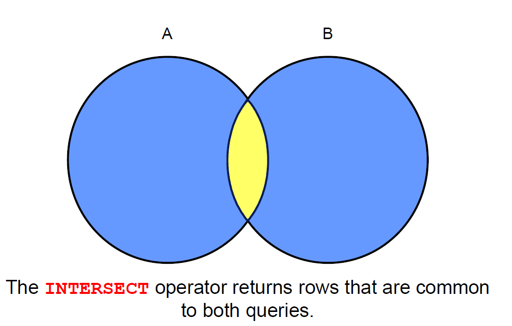

# Set operators

{ width=700 }

# Tables Used

- EMPLOYEES: Provides details regarding all current employees
- JOB_HISTORY: Records the details of the start date and end date of the former job, and the job identification number and department when an employee switches jobs

When an employee switches jobs, the details of the start date and end date of the former job, the job identification number, and the department are recorded in the JOB_HISTORY table.

# UNION Operator

{ width=700 }

Display the current and previous job details of all employees. Display each employee only once.

```sql
SELECT employee_id, job_id
FROM nikovits.employees
UNION
SELECT employee_id, job_id
FROM nikovits.job_history;
```

| EMPLOYEE_ID | JOB_ID     |
|-------------|------------|
| 100         | AD_PRES    |
| 101         | AC_ACCOUNT |
| 101         | AC_MGR     |
| 101         | AD_VP      |
| 102         | AD_VP      |
| 102         | IT_PROG    |
| 103         | IT_PROG    |
| 104         | IT_PROG    |
| 105         | IT_PROG    |
| 106         | IT_PROG    |
| 107         | IT_PROG    |
| 108         | FI_MGR     |
| 109         | FI_ACCOUNT |
| 110         | FI_ACCOUNT |
| 111         | FI_ACCOUNT |
| 112         | FI_ACCOUNT |
| 113         | FI_ACCOUNT |
| 114         | PU_MAN     |

# UNION ALL Operator

{ width=700 }

Display the current and previous departments of all employees.

```sql
SELECT employee_id, job_id, department_id
FROM nikovits.employees
UNION ALL
SELECT employee_id, job_id, department_id
FROM nikovits.job_history
ORDER BY employee_id;
```

| EMPLOYEE_ID | JOB_ID     | DEPARTMENT_ID |
|-------------|------------|---------------|
| 100         | AD_PRES    | 90            |
| 101         | AD_VP      | 90            |
| 101         | AC_ACCOUNT | 110           |
| 101         | AC_MGR     | 110           |
| 102         | IT_PROG    | 60            |
| 102         | AD_VP      | 90            |
| 103         | IT_PROG    | 60            |
| 104         | IT_PROG    | 60            |
| 105         | IT_PROG    | 60            |
| 106         | IT_PROG    | 60            |
| 107         | IT_PROG    | 60            |
| 108         | FI_MGR     | 100           |

# INTERSECT Operator

{ width=700 }

Display the employee IDs and job IDs of those employees who currently have a job title that is the same as their job title when they were initially hired (that is, they changed jobs but have now gone back to doing their original job).

```sql
SELECT employee_id, job_id
FROM nikovits.employees
INTERSECT
SELECT employee_id, job_id
FROM nikovits.job_history;
```

| EMPLOYEE_ID | JOB_ID  |
|-------------|---------|
| 176         | SA_REP  |
| 200         | AD_ASST |

# MINUS Operator

{ width=700 }

Display the employee IDs of those employees who have not changed their jobs even once.

```sql
SELECT employee_id,job_id
FROM nikovits.employees
MINUS
SELECT employee_id,job_id
FROM nikovits.job_history;
```

| EMPLOYEE_ID | JOB_ID     |
|-------------|------------|
| 100         | AD_PRES    |
| 101         | AD_VP      |
| 102         | AD_VP      |
| 103         | IT_PROG    |
| 104         | IT_PROG    |
| 105         | IT_PROG    |
| 106         | IT_PROG    |
| 107         | IT_PROG    |
| 108         | FI_MGR     |
| 109         | FI_ACCOUNT |
| 110         | FI_ACCOUNT |
| 111         | FI_ACCOUNT |
| 112         | FI_ACCOUNT |

# Set Operator Guidelines

The expressions in the SELECT lists must match in number and data type.
- Parentheses can be used to alter the sequence of execution.
- The ORDER BY clause:
    - Can appear only at the very end of the statement
    - Will accept the column name, aliases from the first SELECT statement, or the positional notation.

## Key Behaviors of Set Operators in Oracle Server

Set operators (such as `UNION`, `UNION ALL`, `INTERSECT`, `MINUS`) combine the results of two or more queries.

### Important Rules

**Duplicate rows are automatically eliminated**, except in `UNION ALL`.

- `UNION`, `INTERSECT`, and `MINUS` perform distinct processing (remove duplicates).
- `UNION ALL` retains all duplicates.

**Column names from the first query appear in the result**.

- The final result set uses the column names (and aliases) from the **first** SELECT statement.
- Subsequent queries must have compatible columns, but their names/aliases are ignored in the output.

**The output is sorted in ascending order by default**, except in `UNION ALL`.

- `UNION`, `INTERSECT`, and `MINUS` implicitly sort the entire result set in ascending order by all columns (to eliminate duplicates).
- `UNION ALL` does **not** sort the results—it returns rows in the order they are retrieved.

### Common Set Operators

| Operator    | Description                                      | Removes Duplicates? | Sorts Result? |
|-------------|--------------------------------------------------|---------------------|---------------|
| UNION ALL   | Returns all rows from both queries                | No                  | No            |
| UNION       | Returns unique rows from both queries             | Yes                 | Yes           |
| INTERSECT   | Returns rows common to both queries               | Yes                 | Yes           |
| MINUS       | Returns rows from first query not in second      | Yes                 | Yes           |

# Matching the SELECT Statements

Using the UNION operator, display the department ID, location, and hire date for all employees.

```sql
SELECT department_id, TO_NUMBER(null)
location, hire_date
FROM nikovits.employees
UNION
SELECT department_id, location_id, TO_DATE(null)
FROM nikovits.departments;
```

| DEPARTMENT_ID | LOCATION | HIRE_DATE  |
|---------------|----------|------------|
| 10            | 1700     | NULL       |
| 10            | NULL     | 17/09/87   |
| 20            | 1800     | NULL       |
| 20            | NULL     | 17/02/96   |
| 20            | NULL     | 17/08/97   |
| 30            | 1700     | NULL       |
| 30            | NULL     | 07/12/94   |
| 30            | NULL     | 18/05/95   |
| 30            | NULL     | 24/07/97   |
| 30            | NULL     | 24/12/97   |
| 30            | NULL     | 15/11/98   |
| 30            | NULL     | 10/08/99   |
| 40            | 2400     | NULL       |

Using the UNION operator, display the employee ID, job ID, and salary of all employees.

```sql
SELECT employee_id, job_id,salary
FROM nikovits.employees
UNION
SELECT employee_id, job_id,0
FROM nikovits.job_history;
```

| EMPLOYEE_ID | JOB_ID     | SALARY |
|-------------|------------|--------|
| 100         | AD_PRES    | 24000  |
| 101         | AC_ACCOUNT | 0      |
| 101         | AC_MGR     | 0      |
| 101         | AD_VP      | 17000  |
| 102         | AD_VP      | 17000  |
| 102         | IT_PROG    | 0      |
| 103         | IT_PROG    | 9000   |
| 104         | IT_PROG    | 6000   |
| 105         | IT_PROG    | 4800   |
| 106         | IT_PROG    | 4800   |
| 107         | IT_PROG    | 4200   |
| 108         | FI_MGR     | 12000  |
| 109         | FI_ACCOUNT | 9000   |

# Controlling the Order of Rows

Produce an English sentence using two UNION operators.

(Run as a script, not as a single statement.)

```sql
COLUMN a_dummy NOPRINT
SELECT 'sing' AS "My dream", 3 a_dummy
FROM dual
UNION
SELECT 'I''d like to teach', 1 a_dummy
FROM dual
UNION
SELECT 'the world to', 2 a_dummy
FROM dual
ORDER BY a_dummy;
```

| My dream         | A_DUMMY |
|------------------|---------|
| Id like to teach | 1       |
| the world to     | 2       |
| sing             | 3       |

# Data types
# Numbers

- number(x,y) -- x -> precision (number of stored digits), y -> scale (number of decimals, it can be negative)
- number(x) -- x -> precision (number of stored digits), scale defaults to 0.
- int = integer = number(38)
- numeric(x,y) = number(x,y) (synonyms)
- positive and natural -- only in PL/SQL (procedural extension of SQL)

# STRINGS

- varchar2(17) --Variable length string. Maximal length in paranthesis.
- varchar(n) = varchar2(n) (synonyms)
    - Insert: if length of string overrides max. length-> error
- char(15) --Fixed length string. Stored in fixed length, rigth padded with spaces.
    - Insert: if length of string over rides max. length-> error
    - Insert: if length of string is fewer-> rigth padded with spaces.
- Data type of Character literals e.g. 'ABC' (default) --> char(3).
- Take care in case of char(n) data type comparison!!! e.g. 'str' = 'str' (!!!)
    - e.g. SELECT * FROM emp WHERE 'str' = 'str'; -> TRUE for all rows
- In case of varchar comparison, it is different (normal).
    - e.g. SELECT * FROM emp WHERE CAST('str' AS VARCHAR(4)) = 'str'; -> FALSE for all rows

# DATE and TIME

- DATE data type -- stores date and time with seconds precision
- ANSI Date literal: DATE '1998-12-25’
    - The ANSI date literal contains no time portion, and must be specified in the format 'YYYY-MM-DD’.
    - Alternatively, you can specify an Oracle date value with TO_DATE built-in function.
- We can change the date format and language:
    - ALTER SESSION SET NLS_DATE_FORMAT='YYYY-MM-DD (fmDay) HH24:MI:SS’;
    - ALTER SESSION SET NLS_DATE_LANGUAGE='hungarian'; -- can be english, american, french, german
    - SELECT sysdate FROM dual;SELECT to_char(sysdate, 'day') FROM dual;

# Datearithmethic

- d+1 -- d plus one day
- d-2 -- d minus 2 days
- sysdate+7 -- now plus 7 days
- d+1/24 -- d plus 1 hour
- d2-d1 -- time elapsed between d1 and d2 in days
- (d2-d1)*24*60*60 -- time elapsed between d1 and d2 in seconds
- months_between(d2,d1)
- We can get positive and negative result too.
    - d2 > d1 => (+)
    - d2 < d1 => (-)

# TIMESTAMP datatype

- Stores fractional seconds as well
- SELECT SYSTIMESTAMP FROM DUAL; --with Time Zone see NLS_TIMESTAMP_TZ_FORMAT setting
    - --20-APR-08 11.53.17,384707000 +02:00
- SELECT CURRENT_TIMESTAMP FROM DUAL;
    - --20-APR-08 11.53.55,229284000 EUROPE/PRAGUE
- SELECT LOCALTIMESTAMP FROM DUAL; --without Time Zone
    - --20-APR-08 11.54.13,646841000
- SELECT TO_CHAR(SYSTIMESTAMP,'YYYY.MM.DD.HH24:MI:SS.FF TZH:TZM') FROM dual; --using explicit Format Mask
    - --2020.04.08.11:57:50.274611 +02:00
- SELECT TO_CHAR(SYSTIMESTAMP,'SSSSS.FF') FROM dual; --seconds past midnight

# CONVERSION

- to_date('2030-OCT-28') -- conversion based on NLS_DATE_FORMAT
- to_date('2030-12','YYYY-MM') -- giving format elements => 2030-12-01 0:00.00
- The elements we don't give in will be default. Default date: actual year, actual month, first day, midnight
- to_date(2462803,'J') -- Julian date 2462803rd day midnight
- to_char(d) -- output according to NLS_DATE_FORMAT
- to_char(d, 'HH24:MI:SS') -- output according to format elements given
- to_char(127.14) -- number -> string
- to_number('135.00167') -- string -> number
- to_number('abc') -- ORA-01722: invalid number

# Oracle SQL has no boolean type 
# (PL/SQL has. Literals: TRUE, FALSE, NULL)

- NULL value can be in any datatype column.
- Two nulls are never equal, however it is not true that they are not equal (x <> y).
- We can test whether x is null:
    - x IS NULL (wrong -> x = NULL)
    - x IS NOT NULL
- e.g. SELECT * FROM emp WHERE comm IS NOT NULL;