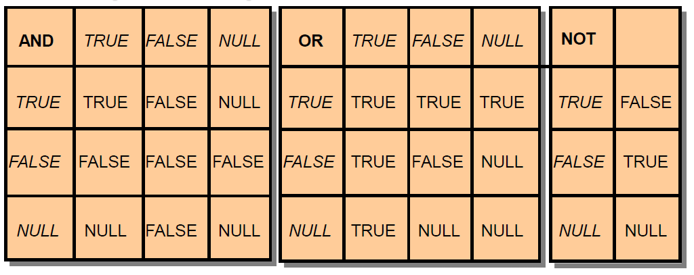

## Benefits of PL/SQL

Improved Performance

{ width=700 }

Parts of a PL/SQL block: declaration, executable, exception handling

```sql
set serveroutput on  -- required if we want to see the output
DECLARE                 
  v NUMBER := 0;
BEGIN
  DBMS_OUTPUT.PUT_LINE('It''s ok ...');  -- notice the double quotes
  v := 1/v;
  DBMS_OUTPUT.PUT_LINE('It is not ...');
EXCEPTION
  WHEN ZERO_DIVIDE THEN
    DBMS_OUTPUT.PUT_LINE('Division by zero');
END;
/        -- !!! Always end PL/SQL blocks with a '/' character !!!
```

<pre>
Results:
---------
It's ok ...
Division by zero
</pre>


## Block Types

{ width=700 }

## Lexical elements of the PL/SQL language: 
## Delimiters, identifiers, literals, comments

Examples for delimiters:

- '+'   Addition operator
- ':=' Assignment operator
- '<<'  Label delimiter (begin)
- '>>'  Label delimiter (end)
- '!='  Relational operator (not equal)

## Identifiers can denote the following PL/SQL objects:

- Constants, Cursors,  Exceptions, Keywords, Labels,  Packages Reserved words, Subprograms, Variables, Types
- Predefined identifiers in STANDARD package, e.g. ZERO_DIVIDE exception

## Literals (numeric, character, string, logical, date)

- integer:       12
- real:          12.0
- char:          'a'
- string:      'abc', ''  (null string, actually NULL)
- logical:     TRUE, FALSE, NULL
- date:        DATE '2011-12-25' 


## Comments: single line and multiline

-- single line comment

/* multiline
   comment
*/


## Variables

- PL/SQL variables:

    - Scalar
    - Composite
    - Reference
    - LOB (large objects)

- Non-PL/SQL variables: Bind and host variables

```sql
-- we cannot put a space into delimiters ( := )
BEGIN
  count := count + 1;   -- correct
  count : = count + 1;  -- incorrect
END;
/
```

```sql
-- DATETIME and INTERVAL literals
DECLARE
  d1 DATE      := DATE '1998-12-25';
  t1 TIMESTAMP := TIMESTAMP '1997-10-22 13:01:01';
  t2 TIMESTAMP WITH TIME ZONE :=   TIMESTAMP '1997-01-31 09:26:56.66 +02:00';
  
  -- Three years and two months
  -- For greater precision, use the day-to-second interval
  i1 INTERVAL YEAR TO MONTH := INTERVAL '3-2' YEAR TO MONTH;
 
  -- Five days, four hours, three minutes, two and 1/100 seconds
   i2 INTERVAL DAY TO SECOND := INTERVAL '5 04:03:02.01' DAY TO SECOND;
BEGIN
  NULL;
END;
/
```

## Variable Initialization and Keywords

Using:

- Assignment operator (:=)
- DEFAULT keyword
- NOT NULL constraint

## Base Scalar Datatypes

- VARCHAR2 (maximum_length)
- NUMBER [(precision, scale)]
- DATE
- CHAR [(maximum_length)]
- LONG
- LONG RAW
- BOOLEAN
- BINARY_INTEGER
- PLS_INTEGER

```sql
-- variable declarations
DECLARE
  part_number       NUMBER(6);     -- SQL data type
  part_name         VARCHAR2(20);  -- SQL data type
  in_stock          BOOLEAN;       -- PL/SQL-only data type
  part_price        NUMBER(6,2);   -- SQL data type
  part_description  VARCHAR2(50);  -- SQL data type
BEGIN
  NULL;
END;
/
```

```sql
-- Constant declarations
DECLARE
  credit_limit     CONSTANT REAL    := 5000.00;  -- SQL data type
  max_days_in_year CONSTANT INTEGER := 366;      -- SQL data type
  urban_legend     CONSTANT BOOLEAN := FALSE;     -- PL/SQL-only data type;
BEGIN
  NULL;
END;
/
```

## Declaring Boolean Variables

- Only the values TRUE, FALSE, and NULL can be assigned to a Boolean variable.
- The variables are connected by the logical operators AND, OR, and NOT.
- The variables always yield TRUE, FALSE, or NULL.
- Arithmetic, character, and date expressions can be used to return a Boolean value.


## Composite Datatypes

- PL/SQL TABLES
- PL/SQL RECORDS

```sql
-- Initialization
DECLARE
  hours_worked    INTEGER := 40;
  employee_count  INTEGER := 0;
  pi     CONSTANT REAL := 3.14159;
  radius          REAL := 1;
  area            REAL := (pi * radius**2);
BEGIN
  NULL;
END;
/
```

```sql
-- Default initializations
DECLARE
  counter INTEGER;  -- initial value is NULL by default
BEGIN
  counter := counter + 1;  -- NULL + 1 is still NULL
  IF counter IS NULL THEN
    DBMS_OUTPUT.PUT_LINE('counter is NULL.');
  END IF;
END;
/
```

<pre>
Results:
---------
counter is NULL.
</pre>

```sql
-- All variables will be NULL
DECLARE
  null_string  VARCHAR2(80) := TO_CHAR('');
  address      VARCHAR2(80);
  zip_code     VARCHAR2(80) := SUBSTR(address, 25, 0);
  name         VARCHAR2(80);
  valid        BOOLEAN      := (name != '');
BEGIN
  NULL;
END;
/
```

```sql
-- %TYPE type inheritance from a column or from other variable
-- in case of column it doesn't inherit constraint, only data type
DECLARE
  v_name  emp.ename%TYPE;
BEGIN
  DBMS_OUTPUT.PUT_LINE('name=' || v_name);
END;
/
```

- Declare a variable according to:
    - A database column definition
    - Another previously declared variable

- Prefix %TYPE with:
    - The database table and column
    - The previously declared variable name

```sql
DECLARE
  name     VARCHAR(25) NOT NULL := 'Smith';
  surname  name%TYPE := 'Jones';               -- inherits NOT NULL constraint too
BEGIN
  DBMS_OUTPUT.PUT_LINE('name=' || name);
  DBMS_OUTPUT.PUT_LINE('surname=' || surname);
END;
/
```

<pre>
Results:
---------
name=Smith
surname=Jones
</pre>

```sql
-- %ROWTYPE record type inheritance (from table, view, cursor, record)
CREATE TABLE employees_temp (
  empid NUMBER(6) NOT NULL PRIMARY KEY,
  deptid NUMBER(6) CONSTRAINT c_employees_temp_deptid CHECK (deptid BETWEEN 100 AND 200),
  deptname VARCHAR2(30) DEFAULT 'Sales' );

DECLARE
  emprec  employees_temp%ROWTYPE;
BEGIN
  emprec.empid := NULL;         -- NOT Null constraint not inherited
  emprec.deptid := 50;          -- Check constraint not inherited
  DBMS_OUTPUT.PUT_LINE ('emprec.deptname: ' || emprec.deptname);  -- Initial value not inherited
END;
/
```

```sql
-- Error if identical names within a PL/SQL unit
DECLARE
  id  BOOLEAN;
  id  VARCHAR2(5);  -- duplicate identifier
BEGIN
  id := FALSE;
END;
/
```

## PL/SQL units are the following:

- PL/SQL anonymous block
- FUNCTION
- LIBRARY
- PACKAGE
- PACKAGE BODY
- PROCEDURE
- TRIGGER
- TYPE
- TYPE BODY

```sql
-- qualified names (within the procedure it refers to local identifier)
-- 'echo' -> name of a label and a procedure
SET SERVEROUTPUT ON
<<echo>>    -- name of a label (we can use labels to qualify PL/SQL program blocks)
DECLARE
  x  NUMBER := 5;
  
  PROCEDURE echo IS   -- name of a procedure
    x  NUMBER := 0;
  BEGIN
    DBMS_OUTPUT.PUT_LINE('x = ' || x);             -- output: x = 0
    DBMS_OUTPUT.PUT_LINE('echo.x = ' || echo.x);   -- output: echo.x = 0 (variable of the procedure)
  END;
 
BEGIN
  echo;
END;
/
```

<pre>
Results:
---------
x = 0
echo.x = 0
</pre>

```sql
-- initialization of a logical variable
DECLARE
  done    BOOLEAN;               -- Initial value is NULL by default
  counter NUMBER := 0;
BEGIN
  done := FALSE;                 -- Assign literal value
  WHILE done != TRUE             -- Compare to literal value
  LOOP
    counter := counter + 1;
    done := (counter > 500);     -- Assign value of BOOLEAN expression
  END LOOP;
  DBMS_OUTPUT.PUT_LINE(counter);  -- output: 501
END;
/
```

<pre>
Results:
---------
501
</pre>

## Operators in PL/SQL

Examples:

- Increment the index for a loop.

    - v_count := v_count + 1;

- Set the value of a Boolean flag.

    - v_equal := (v_n1 = v_n2);

- Validate an employee number if it contains a value.

    - v_valid := (v_empno IS NOT NULL);

```sql
-- SELECT data from a table into a variable
set serveroutput on
DECLARE
  bonus   NUMBER(7,2);
BEGIN
  SELECT sal * 0.10 INTO bonus
  FROM emp                        -- you need table EMP !!!
  WHERE empno = 7900;
  DBMS_OUTPUT.PUT_LINE('bonus = ' || TO_CHAR(bonus));
END;
/
```

<pre>
Results:
---------
bonus = 95
</pre>

## Datatype Conversion

- Convert data to comparable datatypes.
- Mixed datatypes can result in an error and affect performance.
- Conversion functions:

  - TO_CHAR
  - TO_DATE
  - TO_NUMBER

Example:

```sql
DECLARE
    v_date VARCHAR2(15);
BEGIN
    SELECT TO_CHAR(hiredate, 'MON. DD, YYYY')
    INTO v_date
    FROM emp
    WHERE empno = 7839;
END;
```

```sql
-- Two NULLs are not equal. Neither != is TRUE for them.
set serveroutput on
DECLARE
  a NUMBER := NULL;
  b NUMBER := NULL;
BEGIN
  IF a = b THEN                         -- yields NULL, not TRUE
    DBMS_OUTPUT.PUT_LINE('a = b');      -- not run
  ELSIF a != b THEN                     -- yields NULL, not TRUE
    DBMS_OUTPUT.PUT_LINE('a != b');     -- not run
  ELSE
    DBMS_OUTPUT.PUT_LINE('Can''t tell if two NULLs are equal');
  END IF;
END;
/
```

<pre>
Results:
---------
Can't tell if two NULLs are equal
</pre>

```sql
-- Concatenation operator ignores NULL.
set serveroutput on
BEGIN
  DBMS_OUTPUT.PUT_LINE ('apple' || NULL || NULL || 'sauce');  -- output: applesauce
END;
/
```

<pre>
Results:
---------
applesauce
</pre>

```sql
-- use brackets
DECLARE
  a INTEGER := 2**2*3**2;
  b INTEGER := (2**2)*(3**2);
BEGIN
  DBMS_OUTPUT.PUT_LINE('a = ' || TO_CHAR(a));   -- output: a = 36
  DBMS_OUTPUT.PUT_LINE('b = ' || TO_CHAR(b));   -- output: b = 36
END;
/
```

<pre>
Results:
---------
a = 36
b = 36
</pre>

```sql
-- lazy evaluation
DECLARE
  on_hand  INTEGER := 0;
  on_order INTEGER := 100;
BEGIN 
  IF (on_hand = 0) OR ((on_order / on_hand) < 5) THEN   -- Will not cause ZERO_DIVIDE exception
    DBMS_OUTPUT.PUT_LINE('On hand quantity is zero.');
  END IF;
END;
/
```

<pre>
Results:
---------
On hand quantity is zero.
</pre>

## Subtypes

Unconstrained (gives only an alias for compatibility purpose)

```sql
SUBTYPE CHARACTER IS CHAR;
```

Contrained (a real subset)

```sql
SUBTYPE INTEGER IS NUMBER(38,0);
```

Predefined subtypes in STANDARD package, you can see them with the following query:

```sql
SELECT text FROM all_source WHERE type='PACKAGE' and name='STANDARD' ORDER BY line;
```

## Examples from the package:

```sql
type BOOLEAN is (FALSE, TRUE);
subtype INTEGER is NUMBER(38,0);
subtype DECIMAL is NUMBER(38,0);
subtype BINARY_INTEGER is INTEGER range '-2147483647'..2147483647;
subtype NATURAL is BINARY_INTEGER range 0..2147483647;
subtype NATURALN is NATURAL not null;
type sys_refcursor is ref cursor;
```

```sql
-- user-defined subtypes (record, table, type inheritance + constraint)
DECLARE
  SUBTYPE BirthDate IS DATE NOT NULL;         -- Based on DATE type
  SUBTYPE Counter IS NATURAL;                 -- Based on NATURAL subtype
  
  SUBTYPE pinteger IS PLS_INTEGER RANGE -9..9;  

  TYPE NameList IS TABLE OF VARCHAR2(10);
  SUBTYPE DutyRoster IS NameList;             -- Based on TABLE type
  
  TYPE TimeRec IS RECORD (minutes INTEGER, hours INTEGER);
  SUBTYPE FinishTime IS TimeRec;                -- Based on RECORD type
  SUBTYPE ID_Num IS employees.employee_id%TYPE; -- Based on column type
BEGIN
  NULL;
END;
/
```

```sql
-- implicit conversion CHAR -> NUMBER
set serveroutput on
DECLARE
  V1  CHAR(10):='1234';
  V2  NUMBER;
BEGIN
  V2 := V1 + 1;                          -- CHAR -> NUMBER
  DBMS_OUTPUT.PUT_LINE ('V2: ' || TO_CHAR(V2));
END;
/
```

<pre>
Results:
---------
V2: 1235
</pre>

```sql
-- Take care of blank-padded semantics in case of CHAR data type !!!
set serveroutput on
DECLARE
  last_name1 CHAR(5)  := 'BELLO';     -- no trailing blanks
  last_name2 CHAR(10) := 'BELLO   ';  -- trailing blanks
BEGIN
  IF last_name1 = last_name2 THEN
    DBMS_OUTPUT.PUT_LINE(last_name1 || '(length:'|| length(last_name1)||') equals ' ||
    last_name2  || '(length:'|| length(last_name2)||')');
  ELSE
    DBMS_OUTPUT.PUT_LINE(last_name2 || ' does not equal ' || last_name1);
  END IF;
END;
/
```

<pre>
Results:
---------
BELLO(length:5) equals BELLO     (length:10)
</pre>


```sql
-- Using TIMESTAMP data type 
-- TIMESTAMP stores the fractional seconds
DECLARE
  start_time   VARCHAR2(50);
  finish_time  VARCHAR2(50);
  elapsed_time NUMBER(30,10);
BEGIN
  -- Get system time as seconds and fractional seconds past midnight:
  SELECT TO_CHAR(SYSTIMESTAMP,'SSSSS.FF') INTO start_time FROM sys.DUAL;
  -- Get system time again:
  SELECT TO_CHAR(SYSTIMESTAMP,'SSSSS.FF') INTO finish_time FROM sys.DUAL;
  elapsed_time := TO_NUMBER(finish_time, '99999.999999') 
                - TO_NUMBER(start_time, '99999.999999');
  DBMS_OUTPUT.PUT_LINE ('Elapsed time: ' || TO_CHAR(elapsed_time,'0.999999'));
END;
/
```

<pre>
Results:
---------
Elapsed time:  0.000055
</pre>

```sql
-- simple CASE expression (this is not a statement but an expression!)
set serveroutput on
DECLARE
  grade CHAR(1) := 'B';
  appraisal VARCHAR2(20);
BEGIN
  appraisal :=
    CASE grade
      WHEN 'A' THEN 'Excellent'
      WHEN 'B' THEN 'Very Good'
      WHEN 'C' THEN 'Good'
      WHEN 'D' THEN 'Fair'
      WHEN 'F' THEN 'Poor'
      ELSE 'No such grade'
    END;
    DBMS_OUTPUT.PUT_LINE ('Grade ' || grade || ' is ' || appraisal);  -- Very Good
END;
/
```

<pre>
Results:
---------
Grade B is Very Good
</pre>

```sql
-- This form of CASE tests equality so grade = NULL will not be TRUE !!!
-- use the other form, see in the next example below
set serveroutput on
DECLARE
  grade CHAR(1); -- NULL by default
  appraisal VARCHAR2(20);
BEGIN
  appraisal :=
  CASE grade
    WHEN NULL THEN 'No grade assigned'  -- grade = NULL
    WHEN 'A' THEN 'Excellent'
    WHEN 'B' THEN 'Very Good'
    WHEN 'C' THEN 'Good'
    WHEN 'D' THEN 'Fair'
    WHEN 'F' THEN 'Poor'
    ELSE 'No such grade'
  END;
  DBMS_OUTPUT.PUT_LINE ('Grade ' || grade || ' is: ' || appraisal);  -- No such grade
END;
/
```

<pre>
Results:
---------
Grade  is: No such grade
</pre>


```sql
-- logical expressions after WHEN
-- First TRUE condition will be returned
set serveroutput on
DECLARE
  grade CHAR(1); -- NULL by default
  appraisal VARCHAR2(20);
BEGIN
  appraisal :=
    CASE
      WHEN grade IS NULL THEN 'No grade assigned'
      WHEN grade = 'A' THEN 'Excellent'
      WHEN grade = 'B' THEN 'Very Good'
      WHEN grade = 'C' THEN 'Good'
      WHEN grade = 'D' THEN 'Fair'
      WHEN grade = 'F' THEN 'Poor'
      ELSE 'No such grade'
    END;
    DBMS_OUTPUT.PUT_LINE ('Grade ' || grade || ' is: ' || appraisal);  -- No grade assigned
END;
/
```

## Logic Tables

Build a simple Boolean condition with a comparison operator.

{ width=700 }

Any arithmetic expression containing a null value evaluates to NULL.

## Retrieving Data in PL/SQL

Retrieve the order date and the ship date for the specified order.

```sql
DECLARE
  v_orderdate ord.orderdate%TYPE;
  v_shipdate ord.shipdate%TYPE;
BEGIN
  SELECT orderdate, shipdate
  INTO v_orderdate, v_shipdate
  FROM ord
  WHERE id = 620;
  ...
END;
```

## Updating Data

Increase the salary of all employees in the emp table who are Analysts.

```sql
DECLARE
  v_sal_increase emp.sal%TYPE := 2000;
BEGIN
  UPDATE emp
  SET sal = sal + v_sal_increase
  WHERE job = 'ANALYST';
END;
```
   
## Control statements

## IF THEN

```sql
IF condition THEN
  statements
END IF;
```

## IF THEN ELSE

```sql
IF condition THEN
  statements
ELSE
  else_statements
END IF;
```

## IF THEN ELSIF

```sql
IF condition_1 THEN
  statements_1
ELSIF condition_2 THEN
  statements_2
[ ELSIF condition_3 THEN
    statements_3
]...
[ ELSE
    else_statements
]
END IF;
```

## Simple CASE statement

CASE_NOT_FOUND exception if none of them is true

```sql
CASE selector 
WHEN selector_value_1 THEN statements_1
WHEN selector_value_2 THEN statements_2
...
WHEN selector_value_n THEN statements_n
[ ELSE   else_statements ]
END CASE;
```

## Searched CASE statement

CASE_NOT_FOUND exception if none of them is true

```sql
CASE
WHEN condition_1 THEN statements_1
WHEN condition_2 THEN statements_2
...
WHEN condition_n THEN statements_n
[ ELSE   else_statements ]
END CASE;
```

## Basic LOOP

```sql
[ label ] LOOP
  statements
END LOOP [ label ];
```

## Exit from loop / starting a new iteration

```sql
EXIT
EXIT WHEN 
CONTINUE
CONTINUE WHEN
```

## WHILE LOOP

```sql
[ label ] WHILE condition LOOP
  statements
END LOOP [ label ];
```

## FOR LOOP

```sql
[ label ] FOR index IN [ REVERSE ] lower_bound..upper_bound LOOP
  statements
END LOOP [ label ];
```

```sql
BEGIN
 FOR i IN REVERSE 1..3 loop
  dbms_output.put_line(to_char(i));
 END loop;
END;
/
```

```sql
-- NULL statement
NULL;

-- GOTO statement 
GOTO label

-- RETURN statement (return from a subprogram or from an anonymous block)

BEGIN
 FOR i IN 1..3 loop
  dbms_output.put_line(i);
  IF i=2 THEN RETURN; END IF;
 END loop;
END;
/
```

```sql
-- index of FOR loop is local within the loop
set serveroutput on
<<main>>  -- Label block.
DECLARE
  i NUMBER := 5;
BEGIN
  FOR i IN 1..3 LOOP
    DBMS_OUTPUT.PUT_LINE ('local: ' || TO_CHAR(i) || ', global: ' || TO_CHAR(main.i));
  END LOOP;
END main;
/
```

<pre>
Results:
---------
local: 1, global: 5
local: 2, global: 5
local: 3, global: 5
</pre>

```sql
-- Loop indexes in nested loops
/*
- Nest loops to multiple levels.
- Use labels to distinguish between blocks and loops.
- Exit the outer loop with the EXIT statement referencing the label. */
set serveroutput on
BEGIN
  <<outer_loop>>
  FOR i IN 1..3 LOOP
    <<inner_loop>>
    FOR i IN 1..3 LOOP
      IF outer_loop.i = 2 THEN
        DBMS_OUTPUT.PUT_LINE('outer: ' || TO_CHAR(outer_loop.i) || ' inner: ' || TO_CHAR(inner_loop.i));
      END IF;
    END LOOP inner_loop;
  END LOOP outer_loop;
END;
/
```

<pre>
Results:
---------
outer: 2 inner: 1
outer: 2 inner: 2
outer: 2 inner: 3
</pre>

```sql
/*************** scope and visibility *************/
<<label1>>
DECLARE
  a  NUMBER;
BEGIN
  a:=2;
  <<label2>>
  DECLARE
    a number;
  BEGIN
    a:=4;
    dbms_output.put_line(label1.a);
    dbms_output.put_line(label2.a);
    dbms_output.put_line(a);
  END;
  dbms_output.put_line(a);
END;
/
```

<pre>
Results:
---------
2
4
4
2
</pre>

```sql
/************** outer (bind) variables, it works only in SQL*PLUS environment, not in SqlDeveloper *************/
/* program gets a pointer, so it can modify the variable*/
Variable v number;
BEGIN
 :v := mod(121,3);
END;
/
print v;
```

## Using Bind Variables

To reference a bind variable in PL/SQL, you must prefix its name with a colon (:).

```sql
VARIABLE g_salary NUMBER
DECLARE
  v_sal emp.sal%TYPE;
BEGIN
  SELECT sal
  INTO v_sal
  FROM emp
  WHERE empno = 7369;
  :g_salary := v_sal;
END;
```

```sql
/************** printing on the screen *************/
set serveroutput on
BEGIN
  DBMS_OUTPUT.PUT_LINE('Hello World!');
END;
/
```

## Use SET SERVEROUTPUT ON  

A PL/SQL program actually doesn't print on the screen.

It prints into a buffer on the server side.

You can use GET_LINE to read from the buffer.

```sql
SET SERVEROUTPUT ON
DECLARE
  v_status  INTEGER := 0;
  v_line    VARCHAR2(100); 
  v_buff    VARCHAR2(1000);
BEGIN 
  -- We print 3 lines into the buffer.
  DBMS_OUTPUT.PUT_LINE('1-bubu'); DBMS_OUTPUT.PUT_LINE('2-bibi'); DBMS_OUTPUT.PUT_LINE('3-baba');
  -- We empty the buffer.
  WHILE v_status = 0 LOOP
    DBMS_OUTPUT.GET_LINE (v_line, v_status);
    v_buff := v_buff || v_line;
  END LOOP;
  -- We print the concatenated string into the buffer.
  DBMS_OUTPUT.PUT_LINE(v_buff);
END;
/
```

<pre>
Results:
---------
1-bubu2-bibi3-baba
</pre>

Runtime environment reads the buffer only after the program terminated. 

Without 'set serveroutput on' result remains in buffer.

```sql
set serveroutput off     -- notice OFF !!!
BEGIN 
  DBMS_OUTPUT.PUT_LINE('first program');      
  DBMS_OUTPUT.PUT_LINE('second program');     
END;
/
```

```sql
SET SERVEROUTPUT ON
DECLARE
  v_status  INTEGER := 0;
  v_line    VARCHAR2(100); 
BEGIN 
  WHILE v_status = 0 LOOP
    DBMS_OUTPUT.GET_LINE (v_line, v_status);       -- reads buffer
  END LOOP;
  DBMS_OUTPUT.PUT_LINE('second program');          -- writes into buffer
END;
/
```

```sql
/****************** Input from the user ****************/
/* substitution happens before SQL statement is sent to Oracle Server */

ACCEPT v1 NUMBER FORMAT '99' PROMPT 'Give the department number:'
ACCEPT v2 DATE FORMAT 'yyyy.mm.dd' DEFAULT 1982.01.01 PROMPT 'Date (format: 2013.01.30)'
set serveroutput on
DECLARE 
  v_sum NUMBER;
BEGIN
  SELECT sum(sal) INTO v_sum FROM emp WHERE deptno = &v1 AND hiredate < to_date('&v2', 'yyyy.mm.dd');
  dbms_output.put_line(v_sum);
END;
/
```

```sql
/****************** records ****************/
DECLARE
  TYPE rektip IS RECORD(m1 INTEGER, m2 VARCHAR2(10));
  rec rektip;
BEGIN
  rec.m1 := 1; rec.m2 := 'Bubu';
  DBMS_OUTPUT. PUT_LINE(rec.m2);
END;
```

```sql
/****************** records, arrays ****************/
set serveroutput on
DECLARE
  TYPE rek_type IS RECORD(f1 INTEGER DEFAULT 10, f2 dept%ROWTYPE);  -- nested record (ROWTYPE)
  rec rek_type;
  TYPE tab_type IS TABLE OF INTEGER INDEX BY BINARY_INTEGER;   -- associative (index by) array
  TYPE rek_type2 IS RECORD(f1 INTEGER, f2 tab_type);           -- nested array within a field
  rec2 rek_type2;
  rec_oszt dept%ROWTYPE;                                       -- a record too
BEGIN
 rec_oszt.dname := 'SALES';
 dbms_output.put_line(rec.f1);                             -- default value of the field
 
 SELECT * INTO rec.f2 FROM dept WHERE deptno = 10;         -- rec (nested record)
 dbms_output.put_line(rec.f2.loc);
 
 rec2.f2(1) := 100; rec2.f2(2) := 200; rec2.f2(3) := 300;  -- rec2 (array within a field)
 FOR i IN rec2.f2.FIRST .. rec2.f2.LAST LOOP
   dbms_output.put_line(rec2.f2(i));
 END LOOP;
END;
/
```

<pre>
Results:
---------
10
NEW YORK
100
200
300
</pre>

## PL/SQL Records

- Must contain one or more components of any scalar, RECORD, or PL/SQL TABLE datatype, called fields
- Are similar in structure to records in a 3GL
- Are not the same as rows in a database table
- Treat a collection of fields as a logical unit
- Are convenient for fetching a row of data from a table for processing


## Using PL/SQL Table Methods

The following methods make PL/SQL tables easier to use:

- EXISTS
- COUNT
- FIRST and LAST
- PRIOR
- NEXT
- EXTEND
- TRIM
- DELETE


## PL/SQL Tables

- Are composed of two components:
    - Primary key of datatype BINARY_INTEGER
    - Column of scalar or record datatype

- Increase dynamically because they are unconstrained
   

## The %ROWTYPE Attribute

- Declare a variable according to a collection of columns in a database table or view.
- Prefix %ROWTYPE with the database table.
- Fields in the record take their names and datatypes from the columns of the table or view.