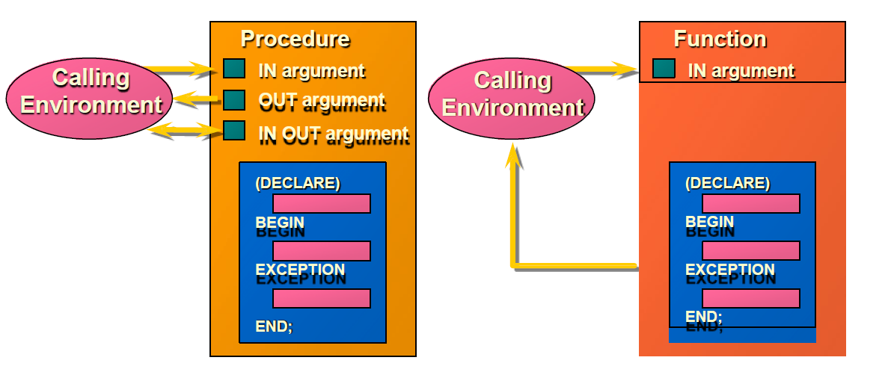

## Exceptions

{ width=700 }

Handling Exceptions:

   - Trap the exception: Exception is raised and trapped within DECLARE, BEGIN, EXCEPTION, END block.
   - Propagate the exception: Exception is raised, not trapped, and propagates to calling environment.

Exception Types:

   - Predefined Oracle Server: Implicitly raised
   - Non-predefined Oracle Server: Implicitly raised
   - User-defined: Explicitly raised

Trapping Exceptions Guidelines:

   - WHEN OTHERS is the last clause.
   - EXCEPTION keyword starts exception-handling section.
   - Several exception handlers are allowed.
   - Only one handler is processed before leaving the block.
   - Reference the standard name in the exception-handling routine.
   - Sample predefined exceptions:
     - NO_DATA_FOUND
     - TOO_MANY_ROWS
     - INVALID_CURSOR
     - ZERO_DIVIDE
     - DUP_VAL_ON_INDEX

```sql
set serveroutput on
DECLARE
  except1 EXCEPTION;
  PRAGMA exception_init(except1, -20000);
BEGIN
  raise_application_error('-20001', 'except2');   -- comment this line
  RAISE except1;                                  -- then comment this line too 
  DECLARE
    V NUMBER := 1/0;                              -- finally change it to 1/1
  BEGIN
    V := 1/0;
  EXCEPTION 
    WHEN OTHERS THEN dbms_output.put_line('inner block');
  END;
EXCEPTION 
  WHEN OTHERS THEN dbms_output.put_line(SQLCODE||' ~~~ '||sqlerrm);
END;
/
```

<pre>
Results:
----------
first output:  -20001 ~~~ ORA-20001: except2
second output: -20000 ~~~ ORA-20000:
third output:  -1476 ~~~ ORA-01476: division by zero
fourth output: inner block
</pre>

Trapping Non-Predefined Oracle Server Errors:

   - Declare: Name the exception (Declarative section)
   - Associate: Code the PRAGMA EXCEPTION_INIT
   - Reference: Handle the raised exception (Exception-handling section)

```sql
e_emps_remaining EXCEPTION;
PRAGMA EXCEPTION_INIT (e_emps_remaining, -2292)
```

Trapping User-Defined Exceptions:

   - Declare: Name the exception (Declarative section)
   - Raise: Explicitly raise the exception by using the RAISE statement (Executable section)
   - Reference: Handle the raised exception (Exception-handling section)

```sql
e_invalid_product EXCEPTION;
RAISE e_invalid_product;
```

Functions for Trapping Exceptions:

   - SQLCODE: Returns the numeric value for the error code
   - SQLERRM: Returns the message associated with the error number

```sql
/* Raising an error from a subprogram */

DECLARE
  v1 NUMBER :=0;
  FUNCTION f1 RETURN NUMBER IS
  except1 EXCEPTION;
  BEGIN
    raise except1;                                    -- comment this line
    raise_application_error('-20000', 'exception1');  -- finally comment this too
    RETURN 10;
  EXCEPTION 
    WHEN except1 THEN RETURN 20;
    WHEN OTHERS THEN RETURN 30;                       -- then comment this too
  END f1;
BEGIN
  v1 := f1; dbms_output.put_line(v1);
EXCEPTION 
  WHEN OTHERS THEN dbms_output.put_line(SQLCODE||' ~~~ '||sqlerrm);
END;
/
```

<pre>
Results:
------------
first output:   20
second output:  30
third output:   -20000 ~~~ ORA-20000: exception1
fourth output:  10
</pre>

Calling Environments:

   - SQL*Plus: Displays error number and message to screen
   - Sql Developer: Displays error number and message to screen
   - Oracle Developer Forms: Accesses error number and message in a trigger by means of the ERROR_CODE and ERROR_TEXT packaged functions
   - Precompiler application: Accesses exception number through the SQLCA data structure
   - An enclosing PL/SQL block: Traps exception in exception-handling routine of enclosing block

```sql
raise_application_error (error_number, message[, {TRUE | FALSE}]);
```

RAISE_APPLICATION_ERROR Procedure:

   - A procedure that lets you issue user-defined error messages from stored subprograms
   - Called only from an executing stored subprogram

## Predefined exceptions

```sql
SELECT text FROM all_source WHERE type = 'PACKAGE'
AND name = 'STANDARD' AND lower(text) LIKE '%exception_init%';
```

Put comments before some statements (or delete comments) to test other exceptions.

```sql
SET SERVEROUTPUT ON
BEGIN                       -- 3 nested blocks
 DECLARE
  v1 emp.sal%TYPE;
  v2 emp.comm%TYPE;
  v3 INTEGER := 0;
 BEGIN
  v3 := 1/v3;                  -- comment this second
  BEGIN
   SELECT sal, comm INTO v1, v2 FROM emp WHERE ename LIKE 'S%';  -- then change it to  'X%'
  EXCEPTION
   WHEN too_many_rows THEN 
    BEGIN
     v1 := 1; v2 := 2;
    END;
  END;
  dbms_output.put_line(to_char(v1)||' -- '|| nvl(to_char(v2), 'null'));
 
 EXCEPTION
  WHEN zero_divide THEN dbms_output.put_line('zero divide');      -- comment this first       
  WHEN too_many_rows THEN dbms_output.put_line('too many rows');
 END;
 dbms_output.put_line('main program');
EXCEPTION
  WHEN OTHERS THEN dbms_output.put_line(SQLCODE || ' -- ' || sqlerrm);
END;
/
```

<pre>
Results:
-----------
first output:   zero divide
                main program
second output:  -1476 -- ORA-01476: division by zero
third output:   1 -- 2        too many rows handled
                main program
fourth output:  100 -- ORA-01403: No Data found
</pre>

```sql
-- Printing error codes

BEGIN
 dbms_output.put_line(sqlerrm(-6502));
END;
/
```

```sql
-- put comments before the first 5 lines one by one to test other exceptions

set serveroutput on
DECLARE 
  v_nev  VARCHAR2(20);
  v_szam NUMBER := 0;
  CURSOR emp_cur IS SELECT ename FROM emp;

  error1 EXCEPTION;
  pragma EXCEPTION_INIT(error1, -20001);
  error2 EXCEPTION;
  pragma EXCEPTION_INIT(error2, -20002);

  PROCEDURE err_proc(v NUMBER) IS
  BEGIN
    IF MOD(v, 2) = 0 THEN
      RAISE_APPLICATION_ERROR('-20001', 'error1');
    ELSE
      RAISE_APPLICATION_ERROR('-20002', 'error2');
    END IF;
  END;

BEGIN
  err_proc(1);                                        -- error2
  err_proc(2);                                        -- error1
  v_szam := 1/v_szam;                                 -- zero divide
  SELECT ename INTO v_nev FROM emp WHERE empno < 0;   -- no_data found
  SELECT ename INTO v_nev FROM emp WHERE empno > 0;   -- too_many_rows
  OPEN emp_cur;
  LOOP
    FETCH emp_cur INTO v_nev;
    EXIT WHEN emp_cur%notfound;
    dbms_output.put(v_nev||' -> ');
    dbms_output.put_line(to_char(emp_cur%rowcount));
  END LOOP;
  CLOSE emp_cur;
EXCEPTION
  WHEN error1 THEN
    dbms_output.put_line('error1 occured');
  WHEN error2 THEN
    dbms_output.put_line('error2 occured');
  WHEN zero_divide THEN
    dbms_output.put_line('zero divide error');
  WHEN no_data_found THEN
    dbms_output.put_line('No Data Found error');
  WHEN too_many_rows THEN
    dbms_output.put_line('Too many rows error');
  WHEN OTHERS THEN
    dbms_output.put_line('something else ...');
END;
/
```

## Functions and procedures

## Procedural Parameter Modes

{ width=700 }

{ width=700 }

## IN Parameters

7369 ↔ v_id

```sql
CREATE OR REPLACE PROCEDURE raise_salary
(v_id in emp.empno%TYPE)
IS
BEGIN
  UPDATE emp
  SET sal = sal * 1.10
  WHERE empno = v_id;
END raise_salary;
/
```

Procedure created.

SQL> EXECUTE raise_salary (7369)

PL/SQL procedure successfully completed.

## OUT Parameters

Calling environment

    654 ↔ v_id ↔ v_name ↔ v_salary ↔ v_comm

QUERY_EMP procedure

    v_id, MARTIN v_name, 1250 v_salary, 1400 v_comm

```sql
CREATE OR REPLACE PROCEDURE query_emp
(v_id IN emp.empno%TYPE,
v_name OUT emp.ename%TYPE,
v_salary OUT emp.sal%TYPE,
v_comm OUT emp.comm%TYPE)
IS
BEGIN
  SELECT ename, sal, comm
  INTO v_name, v_salary, v_comm
  FROM emp
  WHERE empno = v_id;
END query_emp;
/
```

## IN OUT Parameters

Calling environment

    '(800)633-0575' ↔ v_phone_no

FORMAT_PHONE procedure

    '(800)633-0575' v_phone_no

```sql
CREATE OR REPLACE PROCEDURE format_phone
(v_phone_no IN OUT VARCHAR2)
IS
BEGIN
   v_phone_no := '(' || SUBSTR(v_phone_no,1,3) || ')'
                     || SUBSTR(v_phone_no,4,3) || '-'
                     || SUBSTR(v_phone_no,7);
END format_phone;
/
```

```sql
-- Some simple examples for PL/SQL functions and procedures
-- These are local (not stored) subprograms
DECLARE
  num number(6);

  FUNCTION func_plus_1(num number) RETURN number IS
    v NUMBER(6);
  BEGIN
    v := num + 1;
    return(v);
  END;

  PROCEDURE proc_plus_1(num number) is
    v NUMBER(6);
  BEGIN
    v := num + 1;
    dbms_output.put_line(TO_CHAR(v));
  END;

BEGIN
  num := func_plus_1(100);
  proc_plus_1(num);
END;
/
```

<pre>
Results: 
-------
102
</pre>

```sql
-- These are stored (in the database) subprograms, we can call them later at any time.

CREATE OR REPLACE FUNCTION func_plus_2(num number) RETURN number IS
  v NUMBER(6);
BEGIN
  v := num + 2;
  return(v);
END;
/      
-- We can call the function from within SQL
SELECT func_plus_2(1000) FROM dual;

CREATE OR REPLACE PROCEDURE proc_plus_2(num number) is
  v NUMBER(6);
BEGIN
  v := num + 2;
  dbms_output.put_line(TO_CHAR(v));
END;
/

-- We can call the procedure
CALL proc_plus_2(2000);
-- Or equivalently
EXECUTE proc_plus_2(2000);
```

```sql
-- subprogram without parameter
set serveroutput on
DECLARE
  num number(6) := 1;
  PROCEDURE pr1 is           -- don't use paranthesis!
    v NUMBER(6);
  BEGIN
    v := num + 1;
    dbms_output.put_line(TO_CHAR(v));
  END;
BEGIN
  pr1();    -- you can use paranthesis, but pr1 is ok too
END;
/
```

## Examples of Passing Parameters

```sql
begin
  add_dept(('TRAINING', 'NEW YORK'));
  add_dept(v_loc => 'DALLAS', v_name =>'EDUCATION');
  add_dept(v_loc => 'BOSTON');
end;
/
```

```sql
/*******  overloading   ******/
set serveroutput on
DECLARE
  PROCEDURE proc1(p IN NUMBER) IS
  BEGIN
    DBMS_OUTPUT.PUT_LINE('number param');
  END;

  PROCEDURE proc1(p IN VARCHAR2) IS
  BEGIN
    DBMS_OUTPUT.PUT_LINE('varchar2 param');
  END;
BEGIN
  proc1(100);
  proc1('100');
END;
/
```

<pre>
Results:
---------
number param
varchar2 param
</pre>

```sql
/****************** forward declaration ****************/
set serveroutput on
DECLARE
  PROCEDURE proc2(p IN NUMBER);

  PROCEDURE proc1(p IN NUMBER) IS
  BEGIN
    IF p < 10 THEN  DBMS_OUTPUT.PUT_LINE(p); proc2(p+1);  END IF;
  END;

  PROCEDURE proc2(p IN NUMBER) IS
  BEGIN
    IF p < 10 THEN  DBMS_OUTPUT.PUT_LINE(p); proc1(p*2);  END IF;
  END;
BEGIN
  proc1(0);
END;
/
```

<pre>
Results:
---------
0; 1; 2; 3; 6; 7;
</pre>

## Executing Functions

- Invoke a function as part of a PL/SQL expression.
- Create a host variable to hold the returned value.
- Execute the function. The host variable will be populated by the RETURN value.

## Executing Functions in SQL*Plus

{ width=700 }

```sql
-- return value of a function as a default parameter of a procedure
set serveroutput on
DECLARE
  cnt pls_integer := 0;

  FUNCTION dflt RETURN pls_integer IS
  BEGIN
    cnt := cnt + 1;         -- changes global variable cnt
    RETURN 42;
  END dflt;

  PROCEDURE p (i IN pls_integer := dflt() ) IS    -- side effect if parameter is not provided
  BEGIN
    DBMS_Output.Put_Line(i);
  END p;

BEGIN
  FOR j IN 1..3 LOOP
   p(j);            -- Actual parameter is provided, no function call
  END loop;
  DBMS_Output.Put_Line('cnt: '||cnt);
  p();              -- Actual parameter is not provided, function call, side effect
  DBMS_Output.Put_Line('cnt: '||cnt);
END;
/
```

<pre>
Result:
---------
1
2
3
Cnt: 0
42
Cnt: 1
</pre>

## Calling Functions from SQL Expressions: Restrictions

- A user-defined function must be a stored function.
- A user-defined function must be a ROW function, not a GROUP function.
- A user-defined function only takes IN parameters, not OUT, or IN OUT.
- Datatypes must be CHAR, DATE, or NUMBER, not PL/SQL types such as BOOLEAN, RECORD, or TABLE.
- Return type must be an Oracle Server internal type.
- INSERT, UPDATE, or DELETE commands are not allowed.
- Calls to subprograms that break the above restriction are not allowed.

## Procedure or Function?

{ width=700 }

| Procedure                     | Function                        |
|-------------------------------|---------------------------------|
| Execute as a PL/SQL statement | Invoke as part of an expression |
| No RETURN datatype            | Must contain a RETURN datatype  |
| Can return one or more values | Must return a value             |