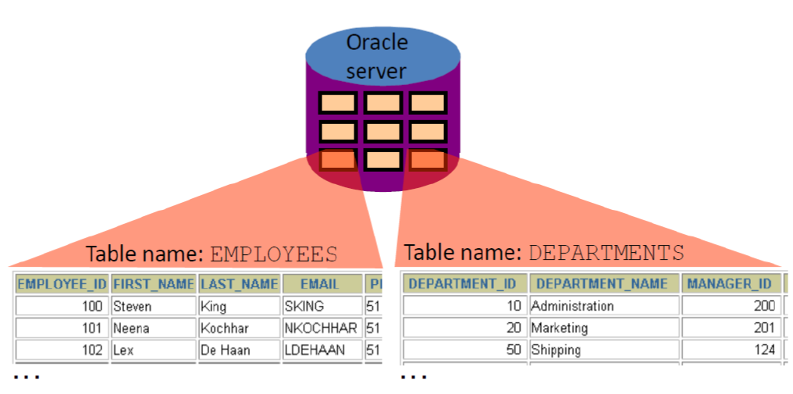
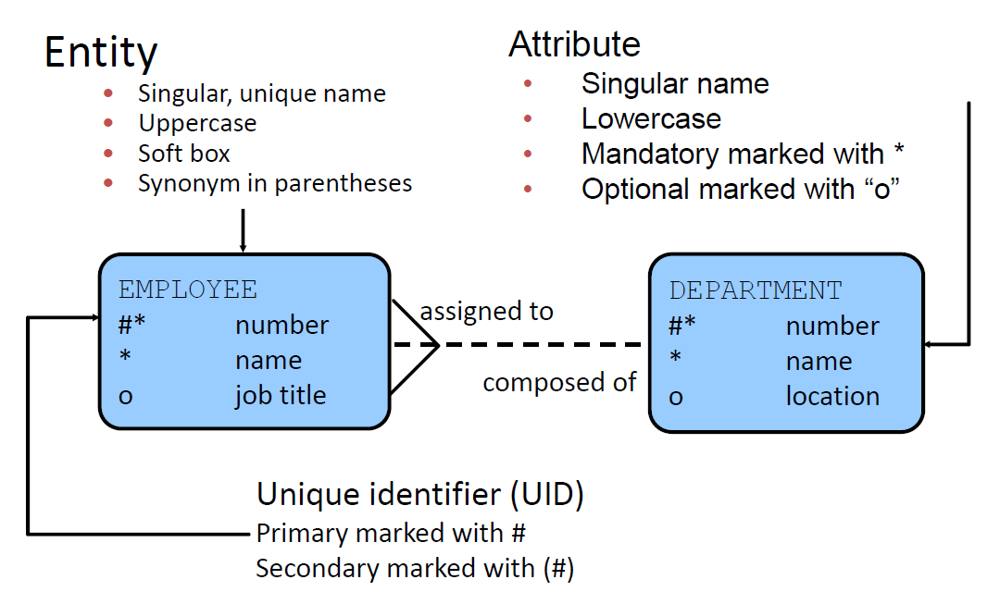
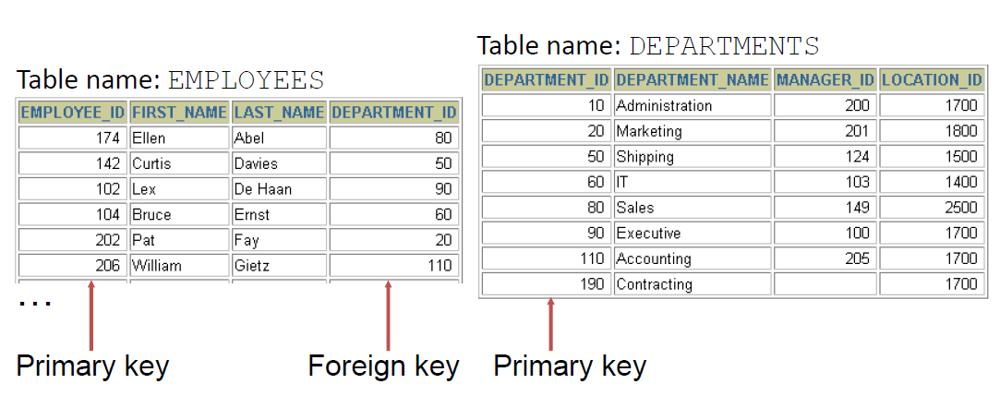

# Relational Model and Introduction

- Dr. E. F. Codd proposed the relational model fordatabase systems in 1970.
- It is the basis for the relational databasemanagement system (RDBMS).
- The relational model consists of the following:
    - Collection of objects or relations
    - Set of operators to act on the relations
    - Data integrity for accuracy and consistency

A relational database is a collection of relations or two dimensional tables.

{ width=700 }

## Data Models

{ width=700 }

## Entity Relationship Model

Create an entity relationship diagram frombusiness specifications or narratives:

{ width=700 }

Scenario:

- ". . . Assign one or more employees to adepartment . . ."
- ". . . Some nikovits.departments do not yet have assignedemployees . . ."

## Entity Relationship Modeling Conventions

{ width=700 }

## Relating Multiple Tables

- Each row of data in a table is uniquely identified bya primary key (PK).
- You can logically relate data from multiple tablesusing foreign keys (FK).

{ width=700 }

## Relational Database Terminology

{ width=700 }

## Relational Database Properties:

- Can be accessed and modified by executingstructured query language (SQL) statements
- Contains a collection of tables with no physicalpointers
- Uses a set of operators

## Communicating with an RDBMS Using SQL

{ width=700 }

## SQL Statements

{ width=700 }

## Order of Statements

{ width=700 }

## Tables Used in the Course

{ width=700 }
