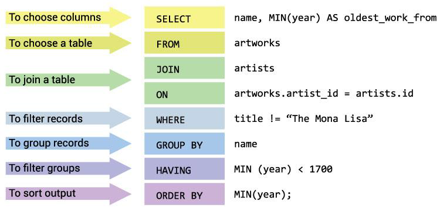
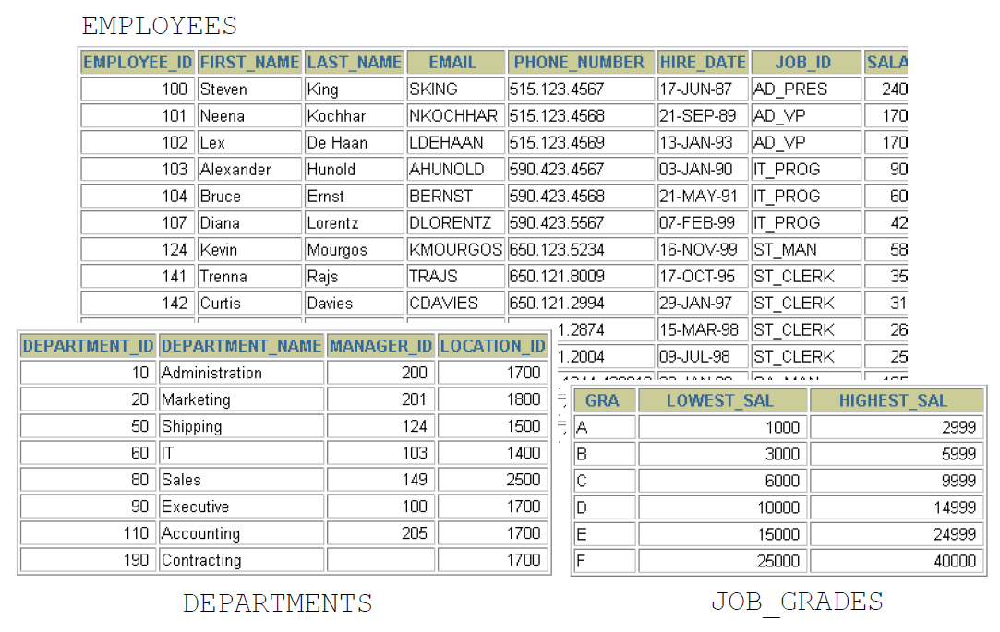

# Communicating with an RDBMS Using SQL

{ width=700 }

# SQL Statements

{ width=700 }

# Order of Statements

{ width=700 }

# Tables Used in the Course

{ width=700 }

# Capabilities of SQL SELECT Statements

{ width=700 }

# Basic SELECT Statement

```sql
SELECT * | {[DISTINCT] column|expression [alias], ...}
FROM table;
```

- SELECT identifies the columns to be displayed
- FROM identifies the table containing those columns

# Selecting All Columns

```sql
SELECT * FROM nikovits.departments;
```

| DEPARTMENT_ID | DEPARTMENT_NAME      | MANAGER_ID | LOCATION_ID |
|---------------|----------------------|------------|-------------|
| 10            | Administration       | 200        | 1700        |
| 20            | Marketing            | 201        | 1800        |
| 30            | Purchasing           | 114        | 1700        |
| 40            | Human Resources      | 203        | 2400        |
| 50            | Shipping             | 121        | 1500        |
| 60            | IT                   | 103        | 1400        |
| 70            | Public Relations     | 204        | 2700        |
| 80            | Sales                | 145        | 2500        |
| 90            | Executive            | 100        | 1700        |
| 100           | Finance              | 108        | 1700        |
| 110           | Accounting           | 205        | 1700        |
| 120           | Treasury             | NULL       | 1700        |
| 130           | Corporate Tax        | NULL       | 1700        |

# Selecting Specific Columns

```sql
SELECT department_id, location_id
FROM nikovits.departments;
```

| DEPARTMENT_ID | LOCATION_ID |
|---------------|-------------|
| 10            | 1700        |
| 20            | 1800        |
| 30            | 1700        |
| 40            | 2400        |
| 50            | 1500        |
| 60            | 1400        |
| 70            | 2700        |
| 80            | 2500        |
| 90            | 1700        |
| 100           | 1700        |
| 110           | 1700        |
| 120           | 1700        |
| 130           | 1700        |
| 140           | 1700        |
| 150           | 1700        |
| 160           | 1700        |

# Writing SQL Statements

- SQL statements are not case-sensitive.
- SQL statements can be on one or more lines.
- Keywords cannot be abbreviated or splitacross lines.
- Clauses are usually placed on separate lines.
- Indents are used to enhance readability.
- In SQL*Plus, SQL statements can optionally beterminated by a semicolon (;). Semicolons arerequired if you execute multiple SQLstatements.

# Arithmetic Expressions

| Operator | Description |
|----------|-------------|
| +        | Add        |
| -        | Subtract   |
| *        | Multiply   |
| /        | Divide     |

# Using Arithmetic Operators

```sql
SELECT last_name, salary, salary + 300
FROM nikovits.employees;
```

| LAST_NAME    | SALARY | SALARY+300 |
|--------------|--------|------------|
| King         | 24000  | 24300      |
| Kochhar      | 17000  | 17300      |
| De Haan      | 17000  | 17300      |
| Hunold       | 9000   | 9300       |
| Ernst        | 6000   | 6300       |
| Austin       | 4800   | 5100       |
| Pataballa    | 4800   | 5100       |
| Lorentz      | 4200   | 4500       |
| Greenberg    | 12000  | 12300      |
| Faviet       | 9000   | 9300       |
| Chen         | 8200   | 8500       |
| Sciarra      | 7700   | 8000       |
| Urman        | 7800   | 8100       |

# Operator Precedence

```sql
SELECT last_name, salary, 12*salary+100
FROM nikovits.employees;
```

| LAST_NAME    | SALARY | 12*SALARY+100 |
|--------------|--------|---------------|
| King         | 24000  | 288100        |
| Kochhar      | 17000  | 204100        |
| De Haan      | 17000  | 204100        |
| Hunold       | 9000   | 108100        |
| Ernst        | 6000   | 72100         |
| Austin       | 4800   | 57700         |
| Pataballa    | 4800   | 57700         |
| Lorentz      | 4200   | 50500         |
| Greenberg    | 12000  | 144100        |
| Faviet       | 9000   | 108100        |
| Chen         | 8200   | 98500         |
| Sciarra      | 7700   | 92500         |

```sql
SELECT last_name, salary, 12*(salary+100)
FROM nikovits.employees;
```

| LAST_NAME    | SALARY | 12*(SALARY+100) |
|--------------|--------|-----------------|
| King         | 24000  | 289200          |
| Kochhar      | 17000  | 205200          |
| De Haan      | 17000  | 205200          |
| Hunold       | 9000   | 109200          |
| Ernst        | 6000   | 73200           |
| Austin       | 4800   | 58800           |
| Pataballa    | 4800   | 58800           |
| Lorentz      | 4200   | 51600           |
| Greenberg    | 12000  | 145200          |
| Faviet       | 9000   | 109200          |
| Chen         | 8200   | 99600           |
| Sciarra      | 7700   | 93600           |
| Urman        | 7800   | 94800           |

# Defining a Null Value

- A null is a value that is unavailable, unassigned,unknown, or inapplicable.
- A null is not the same as a zero or a blank space.

```sql
SELECT last_name, job_id, salary, commission_pct
FROM nikovits.employees;
```

| LAST_NAME    | JOB_ID       | SALARY | COMMISSION_PCT |
|--------------|--------------|--------|----------------|
| King         | AD_PRES      | 24000  | NULL           |
| Kochhar      | AD_VP        | 17000  | NULL           |
| De Haan      | AD_VP        | 17000  | NULL           |
| Hunold       | IT_PROG      | 9000   | NULL           |
| Ernst        | IT_PROG      | 6000   | NULL           |
| Austin       | IT_PROG      | 4800   | NULL           |
| Pataballa    | IT_PROG      | 4800   | NULL           |
| Lorentz      | IT_PROG      | 4200   | NULL           |
| Greenberg    | FI_MGR       | 12000  | NULL           |
| Faviet       | FI_ACCOUNT   | 9000   | NULL           |
| Chen         | FI_ACCOUNT   | 8200   | NULL           |
| Sciarra      | FI_ACCOUNT   | 7700   | NULL           |
| Urman        | FI_ACCOUNT   | 7800   | NULL           |

# Null Values in Arithmetic Expressions

Arithmetic expressions containing a null value evaluate to null.

```sql
SELECT last_name, 12*salary*commission_pct
FROM nikovits.employees;
```

| LAST_NAME    | 12*SALARY*COMMISSION_PCT |
|--------------|--------------------------|
| King         | NULL                     |
| Kochhar      | NULL                     |
| De Haan      | NULL                     |
| Hunold       | NULL                     |
| Ernst        | NULL                     |
| Austin       | NULL                     |
| Pataballa    | NULL                     |
| Lorentz      | NULL                     |
| Greenberg    | NULL                     |
| Faviet       | NULL                     |
| Chen         | NULL                     |
| Sciarra      | NULL                     |
| Urman        | NULL                     |

# Defining a Column Alias

- Renames a column heading
- Is useful with calculations
- Immediately follows the column name (There canalso be the optional AS keyword between thecolumn name and alias.)
- Requires double quotation marks if it containsspaces or special characters or if it is case-sensitive

# Using Column Aliases

```sql
SELECT last_name AS name, commission_pct comm
FROM nikovits.employees;
```

| NAME         | COMM |
|--------------|------|
| King         | NULL |
| Kochhar      | NULL |
| De Haan      | NULL |
| Hunold       | NULL |
| Ernst        | NULL |
| Austin       | NULL |
| Pataballa    | NULL |
| Lorentz      | NULL |
| Greenberg    | NULL |
| Faviet       | NULL |
| Chen         | NULL |
| Sciarra      | NULL |
| Urman        | NULL |

```sql
SELECT last_name "Name" , salary*12 "Annual Salary"
FROM nikovits.employees;
```

| Name         | Annual Salary |
|--------------|---------------|
| King         | 288000        |
| Kochhar      | 204000        |
| De Haan      | 204000        |
| Hunold       | 108000        |
| Ernst        | 72000         |
| Austin       | 57600         |
| Pataballa    | 57600         |
| Lorentz      | 50400         |
| Greenberg    | 144000        |
| Faviet       | 108000        |
| Chen         | 98400         |
| Sciarra      | 92400         |
| Urman        | 93600         |

# Concatenation Operator

- Links columns or character strings to other columns
- Is represented by two vertical bars (||)
- Creates a resultant column that is a characterexpression

```sql
SELECT last_name||job_id AS "Employees"
FROM nikovits.employees;
```

| Employees            |
|----------------------|
| KingAD_PRES          |
| KochharAD_VP         |
| De HaanAD_VP         |
| HunoldIT_PROG        |
| ErnstIT_PROG         |
| AustinIT_PROG        |
| PataballaIT_PROG     |
| LorentzIT_PROG       |
| GreenbergFI_MGR      |
| FavietFI_ACCOUNT     |
| ChenFI_ACCOUNT       |
| SciarraFI_ACCOUNT    |
| UrmanFI_ACCOUNT      |

# Literal Character Strings

- A literal is a character, a number, or a date that is included in the SELECT statement.
- Date and character literal values must beenclosed by single quotation marks.
- Each character string is output once for eachrow returned.

```sql
SELECT last_name ||' is a '||job_id
AS "Employee Details"
FROM nikovits.employees;
```

# Alternative Quote(q) Operator

- Specify your own quotation mark delimiter
- Choose any delimiter (or {}, [], <> pairs)
- Increase readability and usability

```sql
SELECT department_name ||
        q'[, it's assigned Manager Id: ]'
        || manager_id
        AS "Department and Manager"
FROM nikovits.departments;
```

# Duplicate Rows

```sql
SELECT department_id
FROM nikovits.employees;
```

| DEPARTMENT_ID |
|---------------|
| 90            |
| 90            |
| 90            |
| 60            |
| 60            |
| 60            |
| 60            |
| 60            |
| 100           |
| 100           |
| 100           |
| 100           |
| 100           |
| 100           |
| 30            |
| 30            |

```sql
SELECT DISTINCT department_id
FROM nikovits.employees;
```

| DEPARTMENT_ID |
|---------------|
| 100           |
| 30            |
| NULL          |
| 90            |
| 20            |
| 70            |
| 110           |
| 50            |
| 80            |
| 40            |
| 60            |
| 10            |

# SQL Statements Versus SQL*Plus Commands

| SQL                                      | SQL*Plus                                      |
|------------------------------------------|-----------------------------------------------|
| A language                               | An environment                                |
| ANSI standard                            | Oracle-proprietary                            |
| Keyword cannot be abbreviated            | Keywords can be abbreviated                   |
| Statements manipulate data and table definitions in the database | Commands do not allow manipulation of values in the database |
| Runs in database                         | Runs on a client machine                      |

# Displaying Table Structure

```sql
DESCRIBE nikovits.employees
```

# Limiting the Rows That Are Selected

Restrict the rows that are returned by using the **WHERE** clause.

```sql
SELECT * | {[DISTINCT] column|expression [alias], ...}
FROM table
[WHERE condition(s)];
```

The WHERE clause follows the FROM clause.

```sql
SELECT employee_id, last_name, job_id, department_id
FROM nikovits.employees
WHERE department_id = 90 ;
```

| EMPLOYEE_ID | LAST_NAME | JOB_ID  | DEPARTMENT_ID |
|-------------|-----------|---------|---------------|
| 100         | King      | AD_PRES | 90            |
| 101         | Kochhar   | AD_VP   | 90            |
| 102         | De Haan   | AD_VP   | 90            |

# Character Strings and Dates

- Character strings and date values are enclosed bysingle quotation marks.
- Character values are case-sensitive, and date valuesare format-sensitive.
- The default date format is DD-MON-YY.

You can change the default date format with:

```sql
ALTER SESSION SET nls_date_format='yyyy.mm.dd';
```

```sql
SELECT last_name, job_id, department_id
FROM nikovits.employees
WHERE last_name = 'Whalen' ;
```

| LAST_NAME | JOB_ID  | DEPARTMENT_ID |
|-----------|---------|---------------|
| Whalen    | AD_ASST | 10            |

# Comparison Conditions

| Operator          | Meaning                          |
|-------------------|----------------------------------|
| =                 | Equal to                         |
| >                 | Greater than                     |
| >=                | Greater than or equal to         |
| <                 | Less than                        |
| <=                | Less than or equal to            |
| <>                | Not equal to                     |
| BETWEEN ... AND ... | Between two values (inclusive) |
| IN (set)          | Match any of a list of values    |
| LIKE              | Match a character pattern        |
| IS NULL           | Is a null value                  |

```sql
SELECT last_name, salary
FROM nikovits.employees
WHERE salary <= 3000 ;
```

| LAST_NAME     | SALARY |
|---------------|--------|
| Baida         | 2900   |
| Tobias        | 2800   |
| Himuro        | 2600   |
| Colmenares    | 2500   |
| Mikkilineni   | 2700   |
| Landry        | 2400   |
| Markle        | 2200   |
| Atkinson      | 2800   |
| Marlow        | 2500   |
| Olson         | 2100   |
| Rogers        | 2900   |
| Gee           | 2400   |
| Philtanker    | 2200   |

# Use the BETWEEN condition to display rows based on arange of values:

```sql
SELECT last_name, salary
FROM nikovits.employees
WHERE salary BETWEEN 2500 AND 3500 ;
```

| LAST_NAME     | SALARY |
|---------------|--------|
| Khoo          | 3100   |
| Baida         | 2900   |
| Tobias        | 2800   |
| Himuro        | 2600   |
| Colmenares    | 2500   |
| Nayer         | 3200   |
| Mikkilineni   | 2700   |
| Bissot        | 3300   |
| Atkinson      | 2800   |
| Marlow        | 2500   |
| Mallin        | 3300   |
| Rogers        | 2900   |

# Use the IN membership condition to test for values in a list:

```sql
SELECT employee_id, last_name, salary, manager_id
FROM nikovits.employees
WHERE manager_id IN (100, 101, 201) ;
```

| EMPLOYEE_ID | LAST_NAME    | SALARY | MANAGER_ID |
|-------------|--------------|--------|------------|
| 101         | Kochhar      | 17000  | 100        |
| 102         | De Haan      | 17000  | 100        |
| 108         | Greenberg    | 12000  | 101        |
| 114         | Raphaely     | 11000  | 100        |
| 120         | Weiss        | 8000   | 100        |
| 121         | Fripp        | 8200   | 100        |
| 122         | Kaufling     | 7900   | 100        |
| 123         | Vollman      | 6500   | 100        |
| 124         | Mourgos      | 5800   | 100        |
| 145         | Russell      | 14000  | 100        |
| 146         | Partners     | 13500  | 100        |

# Using the LIKE Condition

- Use the LIKE condition to perform wildcardsearches of valid search string values.
- Search conditions can contain either literalcharacters or numbers:
    - % denotes zero or many characters.
    - _ denotes one character.

```sql
SELECT first_name
FROM nikovits.employees
WHERE first_name LIKE 'S%' ;
```

| FIRST_NAME   |
|--------------|
| Steven       |
| Shelli       |
| Sigal        |
| Shanta       |
| Steven       |
| Stephen      |
| Sarath       |

# Using the LIKE Condition

You can use the ESCAPE identifier to search forthe actual % and _ symbols.

```sql
SELECT employee_id, last_name, job_id
FROM employees
WHERE job_id LIKE '%SA\_%' ESCAPE '\';
```

```sql
SELECT last_name
FROM nikovits.employees
WHERE last_name LIKE '_o%' ;
```

| LAST_NAME    |
|--------------|
| Kochhar      |
| Lorentz      |
| Popp         |
| Tobias       |
| Colmenares   |
| Vollman      |
| Mourgos      |
| Rogers       |

# Using the NULL Conditions

```sql
SELECT last_name, manager_id
FROM nikovits.employees
WHERE manager_id IS NULL ;
```

| LAST_NAME | MANAGER_ID |
|-----------|------------|
| King      | NULL       |

# Logical Conditions

| Operator | Meaning                                      |
|----------|----------------------------------------------|
| AND      | Returns TRUE if both component conditions are true |
| OR       | Returns TRUE if either component condition is true |
| NOT      | Returns TRUE if the following condition is false |

# 3-valued logic

## AND Operator

| AND   | TRUE | FALSE | NULL |
|-------|------|-------|------|
| **TRUE**  | TRUE | FALSE | NULL |
| **FALSE** | FALSE| FALSE | FALSE|
| **NULL**  | NULL | FALSE | NULL |

## OR Operator

| OR    | TRUE | FALSE | NULL |
|-------|------|-------|------|
| **TRUE**  | TRUE | TRUE  | TRUE |
| **FALSE** | TRUE | FALSE | NULL |
| **NULL**  | TRUE | NULL  | NULL |

## NOT Operator

| NOT   | Result |
|-------|--------|
| TRUE  | FALSE  |
| FALSE | TRUE   |
| NULL  | NULL   |

# Using the AND Operator

```sql
SELECT employee_id, last_name, job_id, salary
FROM nikovits.employees
WHERE salary >=10000
AND job_id LIKE '%MAN%' ;
```

| EMPLOYEE_ID | LAST_NAME    | JOB_ID  | SALARY |
|-------------|--------------|---------|--------|
| 114         | Raphaely     | PU_MAN  | 11000  |
| 145         | Russell      | SA_MAN  | 14000  |
| 146         | Partners     | SA_MAN  | 13500  |
| 147         | Errazuriz    | SA_MAN  | 12000  |
| 148         | Cambrault    | SA_MAN  | 11000  |
| 149         | Zlotkey      | SA_MAN  | 10500  |
| 201         | Hartstein    | MK_MAN  | 13000  |

# Using the OR Operator

```sql
SELECT employee_id, last_name, job_id, salary
FROM nikovits.employees
WHERE salary >= 10000
OR job_id LIKE '%MAN%' ;
```

| EMPLOYEE_ID | LAST_NAME   | JOB_ID  | SALARY |
|-------------|-------------|---------|--------|
| 100         | King        | AD_PRES | 24000  |
| 101         | Kochhar     | AD_VP   | 17000  |
| 102         | De Haan     | AD_VP   | 17000  |
| 108         | Greenberg   | FI_MGR  | 12000  |
| 114         | Raphaely    | PU_MAN  | 11000  |
| 120         | Weiss       | ST_MAN  | 8000   |
| 121         | Fripp       | ST_MAN  | 8200   |
| 122         | Kaufling    | ST_MAN  | 7900   |
| 123         | Vollman     | ST_MAN  | 6500   |
| 124         | Mourgos     | ST_MAN  | 5800   |
| 145         | Russell     | SA_MAN  | 14000  |

# Using the NOT Operator

```sql
SELECT last_name, job_id
FROM nikovits.employees
WHERE job_id
NOT IN ('IT_PROG', 'ST_CLERK', 'SA_REP') ;
```

| LAST_NAME    | JOB_ID     |
|--------------|------------|
| King         | AD_PRES    |
| Kochhar      | AD_VP      |
| De Haan      | AD_VP      |
| Greenberg    | FI_MGR     |
| Faviet       | FI_ACCOUNT |
| Chen         | FI_ACCOUNT |
| Sciarra      | FI_ACCOUNT |
| Urman        | FI_ACCOUNT |
| Popp         | FI_ACCOUNT |
| Raphaely     | PU_MAN     |
| Khoo         | PU_CLERK   |
| Baida        | PU_CLERK   |
| Tobias       | PU_CLERK   |
| Himuro       | PU_CLERK   |

# Rules of Precedence

Operators in SQL expressions are evaluated according to the following precedence (highest to lowest):

| Priority | Operator/Condition                          |
|----------|---------------------------------------------|
| 1        | Arithmetic operators (+, -, *, /)            |
| 2        | Concatenation operator (\|\|)               |
| 3        | Comparison conditions (=, >, <, >=, <=, <>)  |
| 4        | IS [NOT] NULL, LIKE, [NOT] IN                |
| 5        | [NOT] BETWEEN                               |
| 6        | Not equal to (<>)                           |
| 7        | NOT logical condition                       |
| 8        | AND logical condition                       |
| 9        | OR logical condition                        |

You can use **parentheses `()`** to override the default precedence rules and explicitly control the order of evaluation.

```sql
SELECT last_name, job_id, salary
FROM nikovits.employees
WHERE job_id = 'SA_REP'
OR job_id = 'AD_PRES'
AND salary > 15000;
```

| LAST_NAME    | JOB_ID | SALARY |
|--------------|--------|--------|
| King         | AD_PRES| 24000  |
| Tucker       | SA_REP | 10000  |
| Bernstein    | SA_REP | 9500   |
| Hall         | SA_REP | 9000   |
| Olsen        | SA_REP | 8000   |
| Cambrault    | SA_REP | 7500   |
| Tuvault      | SA_REP | 7000   |
| King         | SA_REP | 10000  |
| Sully        | SA_REP | 9500   |
| McEwen       | SA_REP | 9000   |
| Smith        | SA_REP | 8000   |
| Doran        | SA_REP | 7500   |

```sql
SELECT last_name, job_id, salary
FROM nikovits.employees
WHERE (job_id = 'SA_REP'
OR job_id = 'AD_PRES')
AND salary > 15000;
```

| LAST_NAME | JOB_ID  | SALARY |
|-----------|---------|--------|
| King      | AD_PRES | 24000  |

# Using the ORDER BY Clause

- Sort retrieved rows with the ORDER BY clause:
    - ASC: ascending order, default
    - DESC: descending order

```sql
SELECT last_name, job_id, department_id, hire_date
FROM nikovits.employees
ORDER BY hire_date ;
```

| LAST_NAME   | JOB_ID     | DEPARTMENT_ID | HIRE_DATE  |
|-------------|------------|---------------|------------|
| King        | AD_PRES    | 90            | 17/06/87   |
| Whalen      | AD_ASST    | 10            | 17/09/87   |
| Kochhar     | AD_VP      | 90            | 21/09/89   |
| Hunold      | IT_PROG    | 60            | 03/01/90   |
| Ernst       | IT_PROG    | 60            | 21/05/91   |
| De Haan     | AD_VP      | 90            | 13/01/93   |
| Mavris      | HR_REP     | 40            | 07/06/94   |
| Baer        | PR_REP     | 70            | 07/06/94   |
| Higgins     | AC_MGR     | 110           | 07/06/94   |
| Gietz       | AC_ACCOUNT | 110           | 07/06/94   |
| Faviet      | FI_ACCOUNT | 100           | 16/08/94   |
| Greenberg   | FI_MGR     | 100           | 17/08/94   |

# Descending order

```sql
SELECT last_name, job_id, department_id, hire_date
FROM nikovits.employees
ORDER BY hire_date DESC ;
```

| LAST_NAME    | JOB_ID   | DEPARTMENT_ID | HIRE_DATE  |
|--------------|----------|---------------|------------|
| Kumar        | SA_REP   | 80            | 21/04/00   |
| Banda        | SA_REP   | 80            | 21/04/00   |
| Ande         | SA_REP   | 80            | 24/03/00   |
| Markle       | ST_CLERK | 50            | 08/03/00   |
| Lee          | SA_REP   | 80            | 23/02/00   |
| Philtanker   | ST_CLERK | 50            | 06/02/00   |
| Geoni        | SH_CLERK | 50            | 03/02/00   |
| Zlotkey      | SA_MAN   | 80            | 29/01/00   |
| Marvins      | SA_REP   | 80            | 24/01/00   |
| Grant        | SH_CLERK | 50            | 13/01/00   |
| Johnson      | SA_REP   | 80            | 04/01/00   |
| Perkins      | SH_CLERK | 50            | 19/12/99   |
| Gee          | ST_CLERK | 50            | 12/12/99   |

# Alias

```sql
SELECT employee_id, last_name, salary*12 annsal
FROM nikovits.employees
ORDER BY annsal ;
```

| EMPLOYEE_ID | LAST_NAME   | ANNSAL |
|-------------|-------------|--------|
| 132         | Olson       | 25200  |
| 128         | Markle      | 26400  |
| 136         | Philtanker  | 26400  |
| 135         | Gee         | 28800  |
| 127         | Landry      | 28800  |
| 119         | Colmenares  | 30000  |
| 131         | Marlow      | 30000  |
| 140         | Patel       | 30000  |
| 144         | Vargas      | 30000  |
| 182         | Sullivan    | 30000  |
| 191         | Perkins     | 30000  |
| 143         | Matos       | 31200  |

# Multiple columns

```sql
SELECT last_name, department_id, salary
FROM nikovits.employees
ORDER BY department_id, salary DESC;
```

| LAST_NAME   | DEPARTMENT_ID | SALARY |
|-------------|---------------|--------|
| Whalen      | 10            | 4400   |
| Hartstein   | 20            | 13000  |
| Fay         | 20            | 6000   |
| Raphaely    | 30            | 11000  |
| Khoo        | 30            | 3100   |
| Baida       | 30            | 2900   |
| Tobias      | 30            | 2800   |
| Himuro      | 30            | 2600   |
| Colmenares  | 30            | 2500   |
| Mavris      | 40            | 6500   |

# Substitution Variables

# UseSQL*Plus substitution variables to:

- Temporarily store values with single-ampersand (&) and double-ampersand(&&) substitution
- Use substitution variables to supplement the following:
    - WHERE conditions
    - ORDER BY clauses
    - Column expressions
    - Table names
    - Entire SELECT statements

# Using the & Substitution Variable

Use a variable prefixed with an ampersand (&) to prompt the user for a value:

```sql
SELECT employee_id, last_name, salary, department_id
FROM nikovits.employees
WHERE employee_id = &employee_num ;
```

# Character and Date Values with Substitution Variables

Use single quotation marks for date and character values:

```sql
SELECT last_name, department_id, salary*12
FROM nikovits.employees
WHERE job_id = '&job_title' ;
```

# Specifying Column Names, Expressions, and Text

```sql
SELECT employee_id, last_name, job_id,&column_name
FROM nikovits.employees
WHERE &condition
ORDER BY &order_column ;
```

# Using the && Substitution Variable

Use the double ampersand (&&) if you want to reuse the variable value without prompting the user eachtime:

```sql
SELECT employee_id, last_name, job_id, &&column_name
FROM nikovits.employees
ORDER BY &column_name ;
```

- Use the SQL*Plus **DEFINE** command to create and assign a value to a variable.
- Use the SQL*Plus **UNDEFINE** command to remove a variable.

```sql
DEFINE employee_num = 200
SELECT employee_id, last_name, salary, department_id
FROM nikovits.employees
WHERE employee_id = &employee_num ;
UNDEFINE employee_num
```