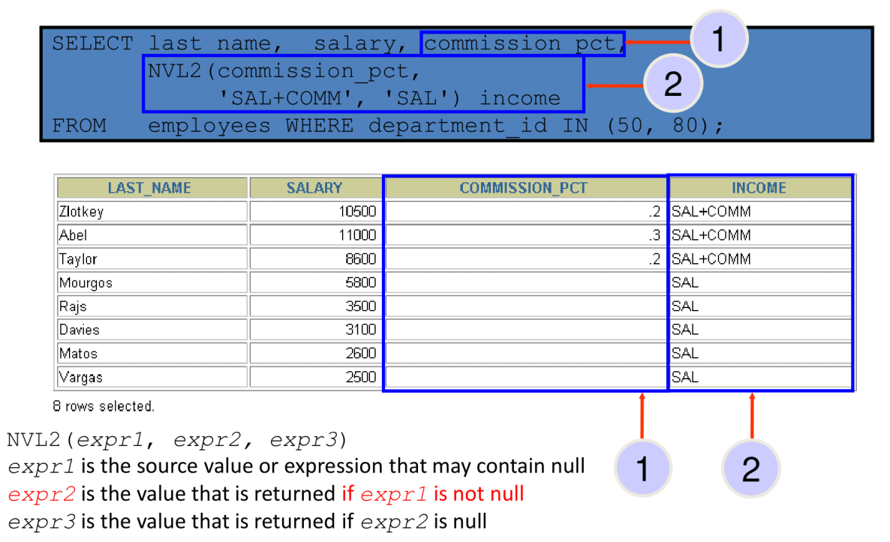
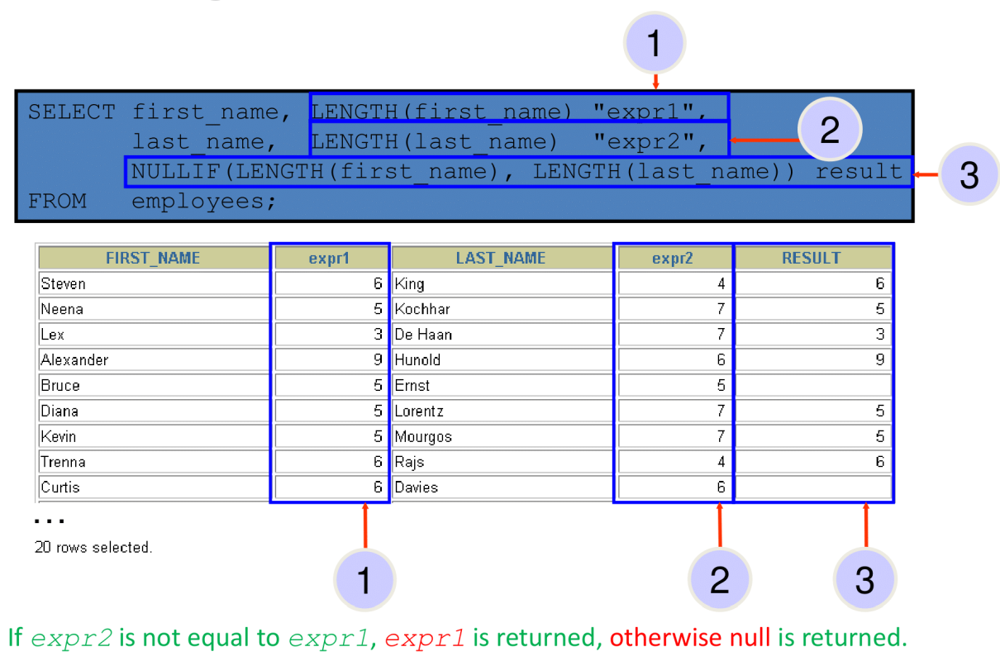

## Nesting Functions

- Single-row functions can be nested to any level.  
- Nested functions are evaluated from the **deepest level** to the **least deep level** (inside-out).

{ width=700 }

```sql
SELECT last_name,
    UPPER(CONCAT(SUBSTR (LAST_NAME, 1, 8), '_US'))
FROM nikovits.employees
WHERE department_id = 60;
```

| LAST_NAME  | UPPER(CONCAT(SUBSTR(LAST_NAME,1,8),'_US')) |
|------------|--------------------------------------------|
| Hunold     | HUNOLD_US                                  |
| Ernst      | ERNST_US                                   |
| Austin     | AUSTIN_US                                  |
| Pataballa  | PATABALL_US                                |
| Lorentz    | LORENTZ_US                                 |

## General Functions

The following functions work with any data type and pertain to using nulls:

    - NVL (expr1, expr2)
    - NVL2 (expr1, expr2, expr3)
    - NULLIF (expr1, expr2)
    - COALESCE (expr1, expr2, ..., exprn)

## NVL Function

Converts a null value to an actual value:

- Data types that can be used are date, character, and number.
- Data types must match:

  - NVL(commission_pct, 0)
  - NVL(hire_date, '01-JAN-97')
  - NVL(job_id, 'No Job Yet')

## Using the NVL Function

{ width=700 }

## Using the NVL2 Function

{ width=700 }

## Using the NULLIF Function

{ width=700 }

## Using the COALESCE Function

- The advantage of the **COALESCE** function over the NVL function is that the COALESCE function can take multiple alternate values.
- If the first expression is not null, the COALESCE function returns that expression; otherwise, it does a COALESCE of the remaining expressions.

```sql
SELECT last_name,
    COALESCE(manager_id,commission_pct, -1) comm
FROM nikovits.employees
ORDER BY commission_pct;
```

| LAST_NAME | COMM |
|-----------|------|
| Lee       | 147  |
| Johnson   | 149  |
| Marvins   | 147  |
| Banda     | 147  |
| Kumar     | 148  |
| Ande      | 147  |
| Greene    | 147  |
| Grant     | 149  |
| Tuvault   | 145  |
| Bates     | 148  |