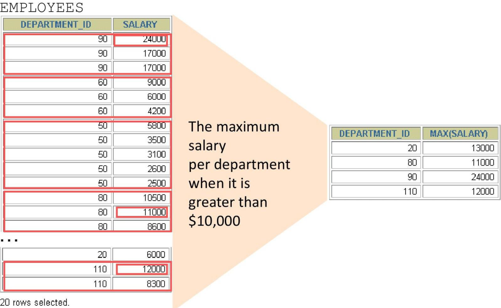

## Creating Groups of Data

{ width=700 }

## Creating Groups of Data: GROUP BY Clause Syntax

```sql
SELECT     column, group_function(column)
FROM       table
[WHERE     condition]
[GROUP BY  group_by_expression]
[ORDER BY  column];
```

You can divide rows in a table into smaller groups by using the GROUP BY clause.

## Using the GROUP BY Clause

All columns in the SELECT list that are not in group functions must be in the GROUP BY clause.

```sql
SELECT department_id, AVG(salary)
FROM nikovits.employees
GROUP BY department_id;
```

| DEPARTMENT_ID        | AVG(SALARY)          |
|----------------------|----------------------|
| 100                  | 8600                 |
| 30                   | 4150                 |
| NULL                 | 7000                 |
| 90                   | 19333.33333333333333 |
| 20                   | 9500                 |
| 70                   | 10000                |
| 110                  | 10150                |
| 50                   | 3475.555555555555555 |
| 80                   | 8955.882352941176470 |
| 40                   | 6500                 |
| 60                   | 5760                 |
| 10                   | 4400                 |

## Using the GROUP BY Clause

The GROUP BY column does not have to be in the SELECT list.

```sql
SELECT AVG(salary)
FROM nikovits.employees
GROUP BY department_id;
```

| AVG(SALARY)          |
|----------------------|
| 8600                 |
| 4150                 |
| 7000                 |
| 19333.33333333333333 |
| 9500                 |
| 10000                |
| 10150                |
| 3475.555555555555555 |
| 8955.882352941176470 |
| 6500                 |
| 5760                 |
| 4400                 |

## Grouping by More Than One Column

{ width=700 }

## Using the GROUP BY Clause on Multiple Columns

```sql
SELECT department_id dept_id, job_id, SUM(salary)
FROM nikovits.employees
GROUP BY department_id, job_id ;
```

| DEPT_ID              | JOB_ID               | SUM(SALARY)          |
|----------------------|----------------------|----------------------|
| 110                  | AC_ACCOUNT           | 8300                 |
| 90                   | AD_VP                | 34000                |
| 50                   | ST_CLERK             | 55700                |
| 80                   | SA_REP               | 243500               |
| 50                   | ST_MAN               | 36400                |
| 80                   | SA_MAN               | 61000                |
| 110                  | AC_MGR               | 12000                |
| 90                   | AD_PRES              | 24000                |
| 60                   | IT_PROG              | 28800                |
| 100                  | FI_MGR               | 12000                |
| 30                   | PU_CLERK             | 13900                |
| 50                   | SH_CLERK             | 64300                |
| 20                   | MK_MAN               | 13000                |
| 100                  | FI_ACCOUNT           | 39600                |
| NULL                 | SA_REP               | 7000                 |
| 70                   | PR_REP               | 10000                |
| 30                   | PU_MAN               | 11000                |
| 10                   | AD_ASST              | 4400                 |
| 20                   | MK_REP               | 6000                 |
| 40                   | HR_REP               | 6500                 |

## Illegal Queries Using Group Functions

Any column or expression in the SELECT list that is not an aggregate function **must** be in the GROUP BY clause:

```sql
SELECT   department_id, COUNT(last_name)
FROM     employees;
```

{ width=700 }

Column missing in the GROUP BY clause

## Illegal Queries Using Group Functions

- You cannot use the **WHERE** clause to restrict groups.
- You use the **HAVING** clause to restrict groups.
- You cannot use group functions in the **WHERE** clause.

```sql
SELECT   department_id, AVG(salary)
FROM     employees
WHERE    AVG(salary) > 8000
GROUP BY department_id;
```

{ width=700 }

Cannot use the WHERE clause to restrict groups

## Restricting Group Functions

{ width=700 }

## Restricting Group Results with the HAVING Clause

- When you use the HAVING clause, the Oracle server restricts groups as follows:
  1. Rows are grouped.
  2. The group function is applied.
  3. Groups matching the HAVING clause are displayed.

```sql
SELECT     column, group_function
FROM       table
[WHERE     condition]
[GROUP BY  group_by_expression]
[HAVING    group_condition]
[ORDER BY  column];
```

## Using the HAVING Clause

```sql
SELECT department_id, MAX(salary)
FROM nikovits.employees
GROUP BY department_id
HAVING MAX(salary)>10000 ;
```

| DEPARTMENT_ID        | MAX(SALARY)          |
|----------------------|----------------------|
| 100                  | 12000                |
| 30                   | 11000                |
| 90                   | 24000                |
| 20                   | 13000                |
| 110                  | 12000                |
| 80                   | 14000                |

```sql
SELECT job_id, SUM(salary) PAYROLL
FROM nikovits.employees
WHERE job_id NOT LIKE '%REP%'
GROUP BY job_id
HAVING SUM(salary) > 13000
ORDER BY SUM(salary);
```

| JOB_ID               | PAYROLL              |
|----------------------|----------------------|
| PU_CLERK             | 13900                |
| AD_PRES              | 24000                |
| IT_PROG              | 28800                |
| AD_VP                | 34000                |
| ST_MAN               | 36400                |
| FI_ACCOUNT           | 39600                |
| ST_CLERK             | 55700                |
| SA_MAN               | 61000                |
| SH_CLERK             | 64300                |

## Nesting Group Functions

- Display the maximum average salary:
- Group functions can be nested to a depth of two.
- The example displays the maximum average salary.

```sql
SELECT MAX(AVG(salary))
FROM nikovits.employees
GROUP BY department_id;
```

| MAX(AVG(SALARY))     |
|----------------------|
| 19333.33333333333333 |