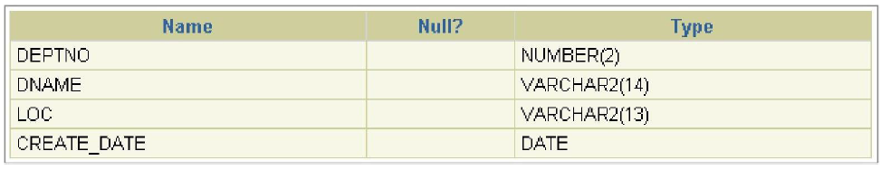
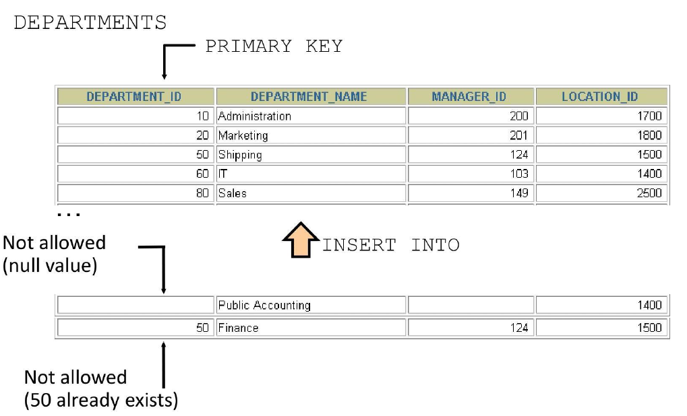
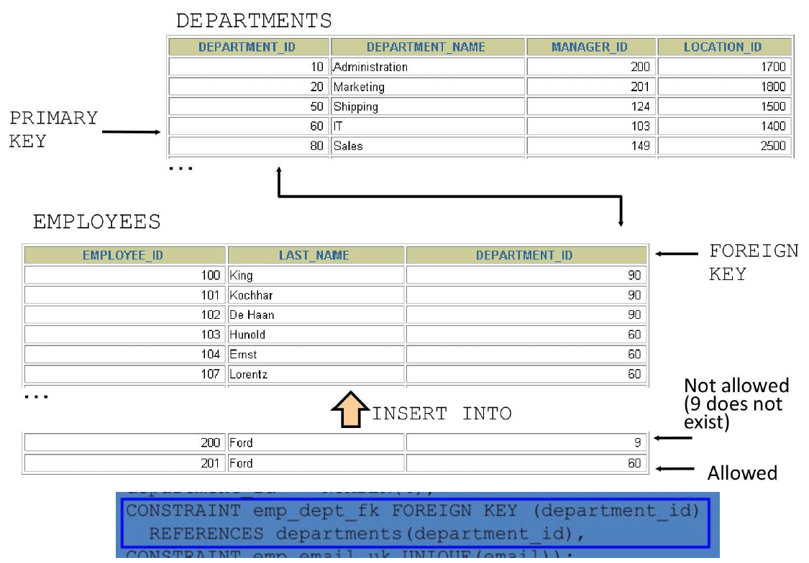

## Data Manipulation Language (DML) in SQL

- A **DML statement** is executed when you:
    - Add new rows to a table
    - Modify existing rows in a table
    - Remove existing rows from a table

- A **transaction** consists of a collection of DML statements that form a **logical unit of work**.

## Adding a New Row to a Table

{ width=700 }

## INSERT Statement Syntax

- Add new rows to a table by using the **INSERT** statement.

```sql
INSERT INTO table [(column [, column...])]
VALUES (value [, value...]);
```

With this syntax, only one row is inserted at a time.

## Inserting New Rows

- Insert a new row containing values for each column.
- List values in the **default order** of the columns in the table.
- Optionally, list the columns explicitly in the `INSERT` clause.
- Enclose character and date values in **single quotation marks**.

```sql
INSERT INTO departments (department_id, department_name, manager_id, location_id)
VALUES (70, 'Public Relations', 100, 1700);
```

## Inserting Rows with NULL Values

## Implicit Method

- Omit the column from the column list.
- The omitted column(s) will receive **NULL** (or default value if defined).

```sql
INSERT INTO departments (department_id, department_name)
VALUES (30, 'Purchasing');
```

## Explicit Method

- Specify the NULL keyword in the VALUES clause.

```sql
INSERT INTO departments
VALUES (100, 'Finance', NULL, NULL);
```

## Copying Rows from Another Table

- Write your **INSERT** statement with a **subquery**.
- **Do not use** the `VALUES` clause.
- Match the number of columns in the `INSERT` clause to those in the subquery.

```sql
INSERT INTO target_table [(column1, column2, ...)]
SELECT column1, column2, ...
FROM source_table
[WHERE condition];
```

## Changing Data in a Table

{ width=700 }

## UPDATE Statement Syntax in Oracle SQL

- Modify existing rows with the **UPDATE** statement.

```sql
UPDATE table
SET column = value [, column = value, ...]
[WHERE condition];
```

- Update more than one row at a time (if required).

- Specific row or rows are modified if you specify the WHERE clause.

```sql
UPDATE employees
SET department_id = 70
WHERE employee_id = 113;
```

- All rows in the table are modified if you omit the WHERE clause.

```sql
UPDATE copy_emp
SET department_id = 110;
```

## Updating Two Columns with a Subquery

Update employee 114's **job** and **salary** to match that of employee 205.

```sql
UPDATE employees
SET job_id = (SELECT job_id
              FROM employees
              WHERE employee_id = 205),
    salary = (SELECT salary
              FROM employees
              WHERE employee_id = 205)
WHERE employee_id = 114;
```

## Removing a Row from a Table

{ width=700 }

## DELETE Statement in Oracle SQL

- You can remove existing rows from a table by using the **DELETE** statement.

```sql
DELETE [FROM] table
[WHERE condition];
```

- Specific rows are deleted if you specify the WHERE clause.

```sql
DELETE FROM departments
WHERE department_name = 'Finance';
```

- All rows in the table are deleted if you omit the WHERE clause.

```sql
DELETE FROM copy_emp;
```

## Deleting Rows Based on Another Table

- Use **subqueries** in `DELETE` statements to remove rows from a table based on values from another table.

```sql
DELETE FROM employees
WHERE department_id = 
    (SELECT department_id
     FROM departments
     WHERE department_name LIKE '%Public%');
```

## TRUNCATE Statement in Oracle SQL

- Removes **all rows** from a table, leaving the table **empty** and the **table structure** intact.
- Is a **data definition language (DDL)** statement rather than a DML statement.
- **Cannot easily be undone** (implicit commit — no ROLLBACK possible).

```sql
TRUNCATE TABLE table_name;
```

Example:

```sql
TRUNCATE TABLE copy_emp;
```

## Using a Subquery in an INSERT Statement

```sql
INSERT INTO 
    (SELECT employee_id, last_name, email, hire_date, job_id, salary, department_id
     FROM employees
     WHERE department_id = 50)
VALUES (99999, 'Taylor', 'DTAYLOR', 
       TO_DATE('07-Jun-99', 'DD-MON-RR'), 
       'ST_CLERK', 5000, 50);
```

Verify the results:

{ width=700 }

## Database Transactions

- A **database transaction** consists of one of the following:
    - **DML statements** that constitute one consistent change to the data
    - **One DDL statement**
    - **One data control language (DCL) statement**

## Database Transactions

- Begins when the **first DML SQL statement** is executed.
- A transaction ends with one of the following events:
    - A **COMMIT** or **ROLLBACK** statement is issued.
    - A **DDL** or **DCL** statement executes (automatic commit).
    - The user exits SQL*Developer (or tool) normally (implicit commit in many tools).
    - The system crashes (changes lost — rollback on restart).

## Advantages of COMMIT and ROLLBACK Statements

With **COMMIT** and **ROLLBACK** statements, you can:

    - **Ensure data consistency**  
    All changes in a transaction succeed together or are undone completely (atomicity).

    - **Preview data changes before making changes permanent**  
    Execute DML statements, query the results, and decide whether to commit or rollback.

    - **Group logically related operations**  
    Treat multiple DML statements as a single logical unit of work.

## Controlling Transactions

{ width=700 }

## Rolling Back Changes to a Marker

- Create a **marker** in a current transaction by using the **SAVEPOINT** statement.
- Roll back to that marker by using the **ROLLBACK TO SAVEPOINT** statement.

{ width=700 }

## Implicit Transaction Processing

- An **automatic commit** occurs under the following circumstances:
    - DDL statement is issued
    - DCL statement is issued
    - Normal exit from SQL Developer, without explicitly issuing COMMIT or ROLLBACK statements

- An **automatic rollback** occurs under an **abnormal termination** of SQL Developer or a **system failure**.

## State of the Data Before COMMIT or ROLLBACK

- The **previous state** of the data can be recovered.
- The current user can review the results of the DML operations by using the **SELECT** statement.
- **Other users** cannot view the results of the DML statements by the current user.
- The affected **rows are locked**; other users cannot change the data in the affected rows.

## State of the Data After COMMIT

After issuing a **COMMIT**:

- Data changes are made **permanent** in the database.
- The **previous state** of the data is **permanently lost**.
- **All users** can view the results.
- Locks on the affected rows are **released**; those rows are available for other users to manipulate.
- **All savepoints** are erased.

## Committing Data

Step 1: Make the Changes

```sql
DELETE FROM employees
WHERE employee_id = 99999;

INSERT INTO departments
VALUES (290, 'Corporate Tax', NULL, 1700);
```

Step 2: Commit the Changes

```sql
COMMIT;
```

## State of the Data After ROLLBACK

- Discard all pending changes by using the **ROLLBACK** statement:
    - Data changes are **undone**.
    - Previous state of the data is **restored**.
    - Locks on the affected rows are **released**.

```sql
DELETE FROM copy_emp;
-- 22 rows deleted.

ROLLBACK;
-- Rollback complete.
```

## State of the Data After ROLLBACK

```sql
DELETE FROM test;               -- ups!, it's a mistake
-- 25,000 rows deleted.

ROLLBACK;                       -- correct the mistake
-- Rollback complete.

DELETE FROM test WHERE id = 100;  -- it's ok
-- 1 row deleted.

SELECT * FROM test WHERE id = 100;
-- No rows selected.  (row successfully removed)

COMMIT;                           -- make it permanent
-- Commit complete.
```

## Statement-Level Rollback

- If a **single DML statement** fails during execution, **only that statement** is rolled back.
- The Oracle server implements an **implicit savepoint**.
- **All other changes** (previous successful statements in the transaction) are **retained**.
- The user should terminate transactions **explicitly** by executing a **COMMIT** or **ROLLBACK** statement.

## Read Consistency

- **Read consistency** guarantees a **consistent view** of the data at all times.
- Changes made by one user do **not conflict** with changes made by another user.
- Read consistency ensures that on the same data:
    - **Readers do not wait** for writers
    - **Writers do not wait** for readers

{ width=700 }

## Database Objects

| Object    | Description                                      |
|-----------|--------------------------------------------------|
| Table     | Basic unit of storage; composed of rows and columns |
| View      | Logically represents subsets of data from one or more tables |
| Sequence  | Generates numeric values (e.g., for auto-incrementing IDs) |
| Index     | Improves the performance of some queries          |
| Synonym   | Gives alternative names to objects                |

## Naming Rules for Database Objects

- **Must begin with a letter** (A–Z or a–z).
- **Must be 1–30 characters long** (Oracle 12.2 and later: up to 128 bytes for most objects).
- **Must contain only**:
    - Alphanumeric characters (A–Z, a–z, 0–9)
    - Underscore (`_`)
    - Dollar sign (`$`)
    - Pound sign (`#`)
- **Must not duplicate** the name of another object owned by the same user.
- **Must not be** an Oracle server **reserved word** (e.g., SELECT, TABLE, FROM).

## CREATE TABLE Statement

You must have:

- **CREATE TABLE** privilege
- A **storage area** (quota in a tablespace)

```sql
CREATE TABLE [schema.]table
    (column datatype [DEFAULT expr] [, ...]);
```

What You Specify
- Table name
- Column name, column data type, and column size

## Referencing Another User's Tables

- Tables belonging to other users are **not** in the user's schema.
- You should use the **owner's name** as a **prefix** to those tables.

This is called **schema-qualified** table reference.

```sql
SELECT * FROM schema_name.table_name;
```

## DEFAULT Option

- Specify a **default value** for a column during an **INSERT**.
- If no value is provided for the column in the INSERT, the default is used automatically.

```sql
column_name datatype DEFAULT expression
```

- Literal values, expressions, or SQL functions are legal values.
- Another column's name or a pseudocolumn are illegal values.
- The default data type must match the column data type (Oracle performs implicit conversion if possible).

```sql
CREATE TABLE hire_dates
    (id          NUMBER(8),
     hire_date   DATE DEFAULT SYSDATE);
```

## Creating Tables

Create the Table

```sql
CREATE TABLE dept
    (deptno      NUMBER(2),
     dname       VARCHAR2(14),
     loc         VARCHAR2(13),
     create_date DATE DEFAULT SYSDATE);
```

Confirm Table Creation

```sql
DESCRIBE dept; -- not SQL Statement
```

{ width=700 }

## Data Types

Oracle provides a variety of data types to store different kinds of information efficiently.

| Data Type                  | Description                                      |
|----------------------------|--------------------------------------------------|
| VARCHAR2(size)             | Variable-length character data (up to 4000 bytes; size in bytes or characters) |
| CHAR(size)                 | Fixed-length character data (padded with spaces; up to 2000 bytes) |
| NUMBER(p, s)               | Variable-length numeric data (p = precision, s = scale) |
| DATE                       | Date and time values (century to seconds)        |
| LONG                       | Variable-length character data (up to 2 GB) — deprecated |
| CLOB                       | Character large object (up to 4 GB)              |
| RAW and LONG RAW           | Raw binary data (deprecated)                     |
| BLOB                       | Binary large object (up to 4 GB)                  |
| BFILE                      | Binary data stored in an external file (up to 4 GB) |
| ROWID                      | A base-64 number system representing the unique address of a row in its table |

## Date and Interval Types

| Data Type                  | Description                                      |
|----------------------------|--------------------------------------------------|
| TIMESTAMP                  | Date with fractional seconds                     |
| INTERVAL YEAR TO MONTH     | Stored as an interval of years and months        |
| INTERVAL DAY TO SECOND     | Stored as an interval of days, hours, minutes, and seconds |

## Datetime Data Types

- The **TIMESTAMP** data type is an extension of the **DATE** data type.
- It stores the year, month, and day of the **DATE** data type plus **hour, minute, and second** values as well as the **fractional second** value.
- You can optionally specify the **time zone**.

| Data Type                                      | Description                                                                 |
|------------------------------------------------|-----------------------------------------------------------------------------|
| TIMESTAMP [(fractional_seconds_precision)]     | Stores date, time, and fractional seconds (precision 0–9, default 6)         |
| TIMESTAMP [(fractional_seconds_precision)] WITH TIME ZONE | Includes time zone offset (e.g., +05:30) or time zone region name          |
| TIMESTAMP [(fractional_seconds_precision)] WITH LOCAL TIME ZONE | Stores in database time zone, automatically converts to user’s local time zone on retrieval |

## Interval Data Types

Oracle provides **interval** data types to store periods of time.

## INTERVAL YEAR TO MONTH

- Stores a period of time using the **YEAR** and **MONTH** datetime fields.

```sql
INTERVAL YEAR [(year_precision)] TO MONTH
```

## INTERVAL DAY TO SECOND

- Stores a period of time in terms of days, hours, minutes, and seconds.

```sql
INTERVAL DAY [(day_precision)] TO SECOND [(fractional_seconds_precision)]
```

## Including Constraints

- **Constraints** enforce rules at the **table level**.
- Constraints **prevent the deletion** of a table if there are dependencies.
- They ensure **data integrity** by restricting what data can be inserted, updated, or deleted.

## Valid Constraint Types

| Constraint Type   | Description                                                                 | Example Use Case                          |
|-------------------|-----------------------------------------------------------------------------|-------------------------------------------|
| NOT NULL          | Column cannot contain NULL values                                           | email, last_name                          |
| UNIQUE            | All values in the column (or combination) must be unique                    | employee_id (if not PK), email            |
| PRIMARY KEY       | Combines NOT NULL + UNIQUE; uniquely identifies each row                   | employee_id, dept_id                      |
| FOREIGN KEY       | Enforces referential integrity — value must exist in referenced table/key  | department_id references departments(dept_id) |
| CHECK             | Ensures column value satisfies a specific condition                        | salary > 0, job_id IN ('SA_REP','IT_PROG') |

## Constraint Guidelines

- You can **name a constraint**, or the Oracle server generates a name by using the **SYS_Cn** format.
- Create a constraint at either of the following times:
    - At the **same time** as the table is created
    - **After** the table has been created
- Define a constraint at the **column** or **table** level.
- View a constraint in the **data dictionary**.

## Defining Constraints

```sql
CREATE TABLE [schema.]table
(
    column datatype [DEFAULT expr]
        [column_constraint],
    ...
    [table_constraint] [, ...]
);
```

Column-Level Constraint

```sql
column [CONSTRAINT constraint_name] constraint_type
```

```sql
CREATE TABLE employees (
    employee_id NUMBER(6)
        CONSTRAINT emp_emp_id_pk PRIMARY KEY,
    first_name  VARCHAR2(20),
    ...
);
```

Table-Level Constraint

```sql
[CONSTRAINT constraint_name] constraint_type (column [, ...])
```

```sql
CREATE TABLE employees (
    employee_id NUMBER(6),
    first_name  VARCHAR2(20),
    ...
    job_id      VARCHAR2(10) NOT NULL,
    CONSTRAINT emp_emp_id_pk PRIMARY KEY (employee_id)
);
```

## NOT NULL Constraint

- Ensures that null values are not permitted for the column.

{ width=700 }

## UNIQUE Constraint

{ width=700 }

## PRIMARY KEY Constraint

{ width=700 }

## FOREIGN KEY Constraint

{ width=700 }

## FOREIGN KEY Constraint: Keywords

- **FOREIGN KEY**: Defines the column in the child table at the table-constraint level
- **REFERENCES**: Identifies the table and column in the parent table
- **ON DELETE CASCADE**: Deletes the dependent rows in the child table when a row in the parent table is deleted
- **ON DELETE SET NULL**: Converts dependent foreign key values to null

## CHECK Constraint

- Defines a condition that each row must satisfy
- The following expressions are not allowed:
    - References to CURRVAL, NEXTVAL, LEVEL, and ROWNUM pseudocolumns
    - Calls to SYSDATE, UID, USER, and USERENV functions
    - Queries that refer to other values in other rows

```sql
..., salary NUMBER(2)
    CONSTRAINT emp_salary_min
    CHECK (salary > 0), ...
```

## Violating Constraints 1

```sql
UPDATE employees
SET    department_id = 55
WHERE  department_id = 110;
```

```sql
UPDATE employees
*
ERROR at line 1:
ORA-02291: integrity constraint (HR.EMP_DEPT_FK)
violated - parent key not found
```

Department 55 does not exist.

## Violating Constraints 2

- You cannot delete a row that contains a **primary key** that is **used as a foreign key** in

```sql
DELETE FROM departments
WHERE  department_id = 60;
```

```sql
DELETE FROM departments
*
ERROR at line 1:
ORA-02292: integrity constraint (HR.EMP_DEPT_FK)
violated - child record found
```

## Creating a Table by Using a Subquery

- Create a table and insert rows by combining the `CREATE TABLE` statement and the `AS subquery` option.

```sql
CREATE TABLE table
    [(column, column...)]
AS subquery;
```

- Match the number of specified columns to the number of subquery columns.
- Define columns with column names and default values.

## Creating a Table by Using a Subquery

```sql
CREATE TABLE dept80
AS
    SELECT  employee_id, last_name,
            salary*12 ANNSAL,
            hire_date
    FROM    employees
    WHERE   department_id = 80;
```

## ALTER TABLE Statement

- Use the ALTER TABLE statement to:
    - Add a new column
    - Modify an existing column
    - Define a default value for the new column
    - Drop a column

## Dropping a Table

- All data and structure in the table are deleted.
- Any pending transactions are committed.
- All indexes are dropped.
- All constraints are dropped.
- You cannot roll back the DROP TABLE statement.

```sql
DROP TABLE dept80;
```