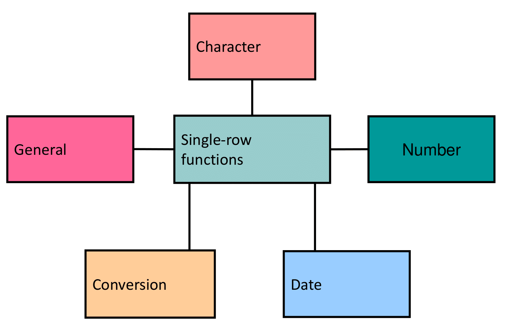

# SQL Functions

{ width=700 }

# Types of SQL Functions

{ width=700 }

# Single-Row Functions

{ width=700 }

- Manipulate data items
- Accept arguments and return one value
- Act on each row that is returned
- Return one result per row
- May modify the data type
- Can be nested
- Accept arguments that can be a column or an expression

# Character Functions

{ width=700 }

# Case-Manipulation Functions in SQL

These functions convert the case for character strings.

## Common Case-Manipulation Functions

| Function                       | Result              | Description                                      |
|--------------------------------|---------------------|--------------------------------------------------|
| LOWER('SQL Course')            | sql course          | Converts all characters to lowercase             |
| UPPER('SQL Course')            | SQL COURSE          | Converts all characters to uppercase             |
| INITCAP('SQL Course')          | Sql Course          | Converts the first letter of each word to uppercase and the rest to lowercase |

# Using Case-Manipulation Functions

Display the employee number, name, and department number for employee Higgins:

```sql
SELECT employee_id, last_name, department_id
FROM nikovits.employees
WHERE last_name = 'higgins';
```

| EMPLOYEE_ID | LAST_NAME | DEPARTMENT_ID |
|-------------|-----------|---------------|

```sql
SELECT employee_id, last_name, department_id
FROM nikovits.employees
WHERE LOWER(last_name) = 'higgins';
```

| EMPLOYEE_ID | LAST_NAME | DEPARTMENT_ID |
|-------------|-----------|---------------|
| 205         | Higgins   | 110           |

# Character-Manipulation Functions in SQL

These functions manipulate character strings.

## Common Character-Manipulation Functions

| Function                                      | Result                  | Description                                                                 |
|-----------------------------------------------|-------------------------|-----------------------------------------------------------------------------|
| CONCAT('Hello', 'World')                      | HelloWorld              | Concatenates two strings (alternative: use `||` operator)                   |
| SUBSTR('HelloWorld', 1, 5)                    | Hello                   | Returns a substring starting at position 1 with length 5                    |
| LENGTH('HelloWorld')                          | 10                      | Returns the length of the string                                            |
| INSTR('HelloWorld', 'W')                      | 6                       | Returns the position of the first occurrence of 'W' (1-based index)         |
| LPAD(salary, 10, '*')                         | ****24000               | Left-pads the value to a total length of 10 using '*' (example: salary=24000)|
| RPAD(salary, 10, '*')                         | 24000*****              | Right-pads the value to a total length of 10 using '*'                       |
| REPLACE('JACK and JUE', 'J', 'BL')            | BLACK and BLUE          | Replaces all occurrences of 'J' with 'BL'                                   |
| TRIM('H' FROM 'HelloWorld')                   | elloWorld               | Removes all leading occurrences of 'H' from the string                       |

# Using the Character-Manipulation Functions

{ width=700 }

# Number Functions in SQL

Number functions perform operations on numeric values.

## Key Number Functions (Oracle SQL)

- **ROUND**: Rounds value to specified decimal places
- **TRUNC**: Truncates value to specified decimal places (no rounding)
- **MOD**: Returns remainder of division

## Examples

| Function                  | Result   | Description                                                                 |
|---------------------------|----------|-----------------------------------------------------------------------------|
| ROUND(45.926, 2)          | 45.93    | Rounds to 2 decimal places (standard rounding: 0.006 → up)                  |
| TRUNC(45.926, 2)          | 45.92    | Truncates to 2 decimal places (cuts off excess without rounding)            |
| MOD(1600, 300)            | 100      | Returns remainder of 1600 ÷ 300 (1600 - 5×300 = 100)                         |

# DUAL Table

**DUAL** is a dummy table that you can use to view results from functions and calculations.

# Using the ROUND Function

{ width=700 }

# Using the TRUNC Function

{ width=700 }

# Using the MOD Function

For all nikovits.employees with job title of Sales Representative, calculate the remainder of the salary after it is divided by 5,000.

```sql
SELECT last_name, salary, MOD(salary, 5000)
FROM nikovits.employees
WHERE job_id = 'SA_REP';
```

| LAST_NAME  | SALARY | MOD(SALARY,5000) |
|------------|--------|------------------|
| Tucker     | 10000  | 0                |
| Bernstein  | 9500   | 4500             |
| Hall       | 9000   | 4000             |
| Olsen      | 8000   | 3000             |
| Cambrault  | 7500   | 2500             |
| Tuvault    | 7000   | 2000             |
| King       | 10000  | 0                |

# Working with Dates

- The Oracle database stores dates in an internal numeric format: century, year, month, day, hours, minutes, and seconds.
- The default date display format is DD-MON-YY. (DD-MON-RR)
    - Enables you to store 21st-century dates in the 20th century by specifying only the last two digits of the year
    - Enables you to store 20th-century dates in the 21st century in the same way

```sql
SELECT last_name, hire_date
FROM nikovits.employees
WHERE hire_date < '01-FEB-88';
```

| LAST_NAME | HIRE_DATE |
|-----------|-----------|
| King      | 17/06/87  |
| Whalen    | 17/09/87  |

# SYSDATE is a function that returns:

- Date
- Time

# Arithmetic with Dates

- Add or subtract a number to or from a date for a resultant date value.
- Subtract two dates to find the number of days between those dates.
- Add hours to a date by dividing the number of hours by 24.

```sql
SELECT last_name, (SYSDATE-hire_date)/7 AS WEEKS
FROM nikovits.employees
WHERE department_id = 90;
```

| LAST_NAME | WEEKS                |
|-----------|----------------------|
| King      | 1995.593908730158730 |
| Kochhar   | 1877.451051587301587 |
| De Haan   | 1704.593908730158730 |

# Date Functions

| Function          | Description                              |
|-------------------|------------------------------------------|
| MONTHS_BETWEEN    | Number of months between two dates       |
| ADD_MONTHS        | Add calendar months to date              |
| NEXT_DAY          | Next day of the date specified           |
| LAST_DAY          | Last day of the month                    |
| ROUND             | Round date                               |
| TRUNC             | Truncate date

# Using Date Functions

| Function                                          | Result             | Explanation                                                                 |
|---------------------------------------------------|--------------------|-----------------------------------------------------------------------------|
| MONTHS_BETWEEN('01-SEP-95', '11-JAN-94')          | 19.6774194         | Calculates the number of months between the two dates (later date first). Includes fractional months based on days. |
| ADD_MONTHS('11-JAN-94', 6)                        | '11-JUL-94'        | Adds 6 calendar months to the specified date.                               |
| NEXT_DAY('01-SEP-95', 'FRIDAY')                   | '08-SEP-95'        | Returns the date of the next Friday after 01-SEP-1995.                      |
| LAST_DAY('01-FEB-95')                             | '28-FEB-95'        | Returns the last day of the month for February 1995 (non-leap year).         |

Assume `SYSDATE = '25-JUL-2003'`.

| Function                          | Result          | Explanation                                                                 |
|-----------------------------------|-----------------|-----------------------------------------------------------------------------|
| ROUND(SYSDATE, 'MONTH')           | 01-AUG-2003     | Rounds to the nearest month. Since July 25 is past the 15th, rounds **up** to August 1. |
| ROUND(SYSDATE, 'YEAR')            | 01-JAN-2004     | Rounds to the nearest year. July 25 is past July 1, so rounds **up** to next year. |
| TRUNC(SYSDATE, 'MONTH')           | 01-JUL-2003     | Truncates to the first day of the current month (always sets day to 1).     |
| TRUNC(SYSDATE, 'YEAR')            | 01-JAN-2003     | Truncates to the first day of the current year (January 1).                 |

# Conversion Functions

{ width=700 }

# Implicit Data Type Conversion

For assignments (e.g., in `INSERT`, `UPDATE`, or variable assignments), the Oracle server can **automatically** perform implicit data type conversions for certain compatible types.

| From                  | To        | Notes                                                                 |
|-----------------------|-----------|-----------------------------------------------------------------------|
| VARCHAR2 or CHAR      | NUMBER    | String must represent a valid number (e.g., '123.45' → 123.45)        |
| VARCHAR2 or CHAR      | DATE      | String must be in the default date format or a recognizable format (depends on NLS_DATE_FORMAT) |
| NUMBER                | VARCHAR2  | Number is converted to its string representation                       |
| DATE                  | VARCHAR2  | Date is converted to string using the current NLS_DATE_FORMAT         |

For **expression evaluation** (e.g., in `WHERE` clause conditions, `SELECT` list expressions, or function arguments), the Oracle Server can **automatically** perform implicit data type conversions for certain compatible types.

| From                  | To        | Notes                                                                 |
|-----------------------|-----------|-----------------------------------------------------------------------|
| VARCHAR2 or CHAR      | NUMBER    | String must represent a valid number; otherwise, runtime error (ORA-01722) |
| VARCHAR2 or CHAR      | DATE      | String must match the session's NLS_DATE_FORMAT or be recognizable   |

# Explicit Data Type Conversion

{ width=700 }

# Using the TO_CHAR Function with Dates

# TO_CHAR(date, 'format_model')

The format model:

- Must be enclosed by single quotation marks
- Is case-sensitive
- Can include any valid date format element
- Has an fm element to remove padded blanks or suppress leading zeros
- Is separated from the date value by a comma TO_CHAR(date, 'format_model')

# Elements of the Date Format Model

| Element | Result                                      | Example (for December 24, 2025 - Wednesday) |
|---------|---------------------------------------------|---------------------------------------------|
| YYYY    | Full year in numbers                        | 2025                                        |
| YEAR    | Year spelled out (in English)               | TWENTY TWENTY-FIVE                          |
| MM      | Two-digit value for month                   | 12                                          |
| MONTH   | Full name of the month                      | DECEMBER                                    |
| MON     | Three-letter abbreviation of the month      | DEC                                         |
| DY      | Three-letter abbreviation of the day of the week | WED                                    |
| DAY     | Full name of the day of the week            | WEDNESDAY                                   |
| DD      | Numeric day of the month                    | 24                                          |

## Time Elements

Time elements format the time portion of the date.

| Format Element       | Example Result          | Description                                      |
|----------------------|-------------------------|--------------------------------------------------|
| HH24:MI:SS AM        | 15:45:32 PM             | 24-hour format with hours, minutes, seconds, and AM/PM indicator |

## Literal Text

Add character strings by enclosing them in **double quotation marks**.

| Format Example          | Result                  | Notes                                            |
|-------------------------|-------------------------|--------------------------------------------------|
| DD "of" MONTH           | 12 of OCTOBER           | "of" is output literally                         |

## Number Suffixes

Number suffixes spell out numbers (ordinal form).

| Format Element | Result       | Description                                      |
|----------------|--------------|--------------------------------------------------|
| ddspth         | fourteenth   | Spells the day with ordinal suffix (e.g., 1st, 2nd, 3rd, 14th) |

# Using the TO_CHAR Function with Dates

```sql
SELECT last_name,
    TO_CHAR(hire_date, 'fmDD Month YYYY')
    AS HIREDATE
FROM nikovits.employees;
```

| LAST_NAME   | HIREDATE          |
|-------------|-------------------|
| King        | 17 June 1987      |
| Kochhar     | 21 September 1989 |
| De Haan     | 13 January 1993   |
| Hunold      | 3 January 1990    |
| Ernst       | 21 May 1991       |
| Austin      | 25 June 1997      |
| Pataballa   | 5 February 1998   |
| Lorentz     | 7 February 1999   |

# Using the TO_CHAR Function with Numbers

```sql
TO_CHAR(number, 'format_model')
```

These are some of the format elements that you can use with the TO_CHAR function to display a number value as a character:

| Element | Result/Description                              |
|---------|-------------------------------------------------|
| 9       | Represents a digit (leading zeros suppressed)   |
| 0       | Forces a zero to be displayed                   |
| $       | Places a floating dollar sign                   |
| L       | Uses the floating local currency symbol         |
| .       | Prints a decimal point                          |
| ,       | Prints a comma as thousands indicator           |


```sql
SELECT TO_CHAR(salary, '$99,999.00') SALARY
FROM nikovits.employees
WHERE last_name = 'Ernst';
```

| SALARY     |
|------------|
| $6,000.00  |

# Using TO_NUMBER and TO_DATE Functions

Convert a character string to a number format using the TO_NUMBER function:

```sql
TO_NUMBER(char[, 'format_model'])
```

Convert a character string to a date format using the TO_DATE function:

```sql
TO_DATE(char[, 'format_model'])
```

- These functions have an FX modifier.
- This modifier specifies the exact matching for the character argument and the format model of a TO_DATE function.

# Nesting Functions

- Single-row functions can be nested to any level.  
- Nested functions are evaluated from the **deepest level** to the **least deep level** (inside-out).

{ width=700 }

```sql
SELECT last_name,
    UPPER(CONCAT(SUBSTR (LAST_NAME, 1, 8), '_US'))
FROM nikovits.employees
WHERE department_id = 60;
```

| LAST_NAME  | UPPER(CONCAT(SUBSTR(LAST_NAME,1,8),'_US')) |
|------------|--------------------------------------------|
| Hunold     | HUNOLD_US                                  |
| Ernst      | ERNST_US                                   |
| Austin     | AUSTIN_US                                  |
| Pataballa  | PATABALL_US                                |
| Lorentz    | LORENTZ_US                                 |

# General Functions

The following functions work with any data type and pertain to using nulls:

    - NVL (expr1, expr2)
    - NVL2 (expr1, expr2, expr3)
    - NULLIF (expr1, expr2)
    - COALESCE (expr1, expr2, ..., exprn)

# NVL Function

Converts a null value to an actual value:

- Data types that can be used are date, character, and number.
- Data types must match:

  - NVL(commission_pct, 0)
  - NVL(hire_date, '01-JAN-97')
  - NVL(job_id, 'No Job Yet')

# Using the NVL Function

{ width=700 }

# Using the NVL2 Function

{ width=700 }

# Using the NULLIF Function

{ width=700 }

# Using the COALESCE Function

- The advantage of the **COALESCE** function over the NVL function is that the COALESCE function can take multiple alternate values.
- If the first expression is not null, the COALESCE function returns that expression; otherwise, it does a COALESCE of the remaining expressions.

```sql
SELECT last_name,
    COALESCE(manager_id,commission_pct, -1) comm
FROM nikovits.employees
ORDER BY commission_pct;
```

| LAST_NAME | COMM |
|-----------|------|
| Lee       | 147  |
| Johnson   | 149  |
| Marvins   | 147  |
| Banda     | 147  |
| Kumar     | 148  |
| Ande      | 147  |
| Greene    | 147  |
| Grant     | 149  |
| Tuvault   | 145  |
| Bates     | 148  |

# Conditional Expressions

- Provide the use of IF-THEN-ELSE logic within a SQL statement
- Use two methods:
    - CASE expression
    - DECODE function

# CASE Expression

Facilitates conditional inquiries by doing the work of an IF-THEN-ELSE statement:

```sql
CASE expr WHEN comparison_expr1 THEN return_expr1
     [WHEN comparison_expr2 THEN return_expr2
      WHEN comparison_exprn THEN return_exprn
      ELSE else_expr]
END
```

# IF THEN ELSE statement:

```sql
SELECT last_name, job_id, salary,
    CASE job_id WHEN 'IT_PROG' THEN 1.10*salary
                WHEN 'ST_CLERK' THEN 1.15*salary
                WHEN 'SA_REP' THEN 1.20*salary
    ELSE salary END "REVISED_SALARY"
FROM nikovits.employees;
```

| LAST_NAME   | JOB_ID  | SALARY | REVISED_SALARY |
|-------------|---------|--------|----------------|
| King        | AD_PRES | 24000  | 24000          |
| Kochhar     | AD_VP   | 17000  | 17000          |
| De Haan     | AD_VP   | 17000  | 17000          |
| Hunold      | IT_PROG | 9000   | 9900           |
| Ernst       | IT_PROG | 6000   | 6600           |
| Austin      | IT_PROG | 4800   | 5280           |
| Pataballa   | IT_PROG | 4800   | 5280           |

# DECODE Function in Oracle SQL

Facilitates conditional inquiries by doing the work of a CASE expression or an IF-THEN-ELSE statement:

```sql
DECODE(col|expression, search1, result1
       [, search2, result2, ...]
       [, default])
```

```sql
SELECT last_name, job_id, salary,
    DECODE(job_id, 'IT_PROG', 1.10*salary,
            'ST_CLERK', 1.15*salary,
            'SA_REP', 1.20*salary,
            salary)
    REVISED_SALARY
FROM nikovits.employees;
```

| LAST_NAME   | JOB_ID  | SALARY | REVISED_SALARY |
|-------------|---------|--------|----------------|
| King        | AD_PRES | 24000  | 24000          |
| Kochhar     | AD_VP   | 17000  | 17000          |
| De Haan     | AD_VP   | 17000  | 17000          |
| Hunold      | IT_PROG | 9000   | 9900           |
| Ernst       | IT_PROG | 6000   | 6600           |
| Austin      | IT_PROG | 4800   | 5280           |
| Pataballa   | IT_PROG | 4800   | 5280           |

# Display the applicable tax rate for each employee in department 80:

```sql
SELECT last_name, salary,
        DECODE (TRUNC(salary/2000, 0),
                            0, 0.00,
                            1, 0.09,
                            2, 0.20,
                            3, 0.30,
                            4, 0.40,
                            5, 0.42,
                            6, 0.44,
                            0.45) TAX_RATE
FROM nikovits.employees
WHERE department_id = 80;
```

| LAST_NAME   | SALARY | TAX_RATE |
|-------------|--------|----------|
| Russell     | 14000  | .45      |
| Partners    | 13500  | .44      |
| Errazuriz   | 12000  | .44      |
| Cambrault   | 11000  | .42      |
| Zlotkey     | 10500  | .42      |
| Tucker      | 10000  | .42      |
| Bernstein   | 9500   | .4       |
| Hall        | 9000   | .4       |
| Olsen       | 8000   | .4       |

# What Are Group Functions?

Group functions operate on sets of rows to give one result per group.

{ width=700 }

# Types of Group Functions

- AVG
- COUNT
- MAX
- MIN
- STDDEV
- SUM
- VARIANCE

# Group Functions: Syntax

```sql
SELECT     [column,] group_function(column), ...
FROM       table
[WHERE     condition]
[GROUP BY  column]
[ORDER BY  column];
```

# Using the AVG and SUM Functions

```sql
SELECT AVG(salary), MAX(salary),
        MIN(salary), SUM(salary)
        FROM nikovits.employees
WHERE job_id LIKE '%REP%';
```

| AVG(SALARY)         | MAX(SALARY) | MIN(SALARY) | SUM(SALARY) |
|---------------------|-------------|-------------|-------------|
| 8272.727272727272727 | 11500       | 6000        | 273000      |

# Using the MIN and MAX Functions

```sql
SELECT MIN(hire_date), MAX(hire_date)
FROM nikovits.employees;
```

| MIN(HIRE_DATE) | MAX(HIRE_DATE) |
|---------------|----------------|
| 17/06/87      | 21/04/00       |

# Using the COUNT Function

# COUNT(*) returns the number of rows in a table:

```sql
SELECT COUNT(*)
FROM nikovits.employees
WHERE department_id = 50;
```

| COUNT(*) |
|----------|
| 45       |

# COUNT(expr) returns the number of rows with non-null values for expr:

```sql
SELECT COUNT(commission_pct)
FROM nikovits.employees
WHERE department_id = 80
```

| COUNT(COMMISSION_PCT) |
|-----------------------|
| 34                    |

# Using the DISTINCT Keyword

- COUNT(DISTINCT expr) returns the number of distinct non-null values of the expr.
- To display the number of distinct department values in the nikovits.employees table:

```sql
SELECT COUNT(DISTINCT department_id)
FROM nikovits.employees;
```

| COUNT(DISTINCT DEPARTMENT_ID) |
|-------------------------------|
| 11                            |

# Group Functions and Null Values

# Group functions ignore null values in the column:

```sql
SELECT AVG(commission_pct)
FROM nikovits.employees;
```

| AVG(COMMISSION_PCT)  |
|----------------------|
| .2228571428571428571 |

# The NVL function forces group functions to include null values:

```sql
SELECT AVG(NVL(commission_pct, 0))
FROM nikovits.employees;
```

| AVG(NVL(COMMISSION_PCT,0))          |
|-------------------------------------|
| .0728971962616822429906542          |