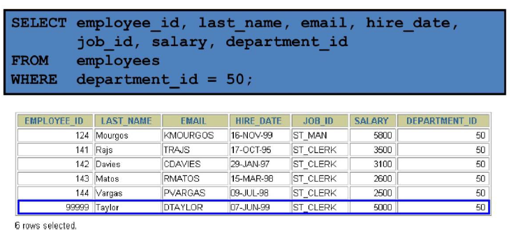
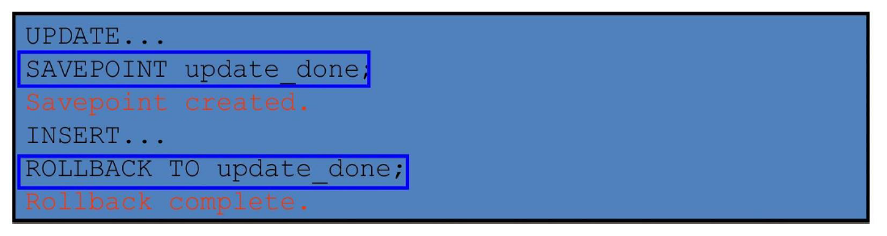

# Multiple-Column Subqueries

```sql
Main query
WHERE (MANAGER_ID, DEPARTMENT_ID) IN
          ┌─────────────────────┐
          │     Subquery        │
          │ 100     90          │
          │ 102     60          │
          │ 124     50          │
          └─────────────────────┘
```

Each row of the main query is compared to values from a multiple-row and multiple-column subquery.

# Pairwise Comparison Subquery

Display the details of the employees who are managed by the same manager **and** work in the same department as the employees with `EMPLOYEE_ID` 199 or 174.

```sql
SELECT employee_id, manager_id, department_id
FROM employees
WHERE (manager_id, department_id) IN
    (SELECT manager_id, department_id
     FROM employees
     WHERE employee_id IN (199, 174))
AND employee_id NOT IN (199, 174);
```

# Nonpairwise Comparison Subquery

Display the details of the employees who are managed by the same manager as the employees with `EMPLOYEE_ID` 174 or 199 **and** work in the same department as the employees with `EMPLOYEE_ID` 174 or 199.

```sql
SELECT employee_id, manager_id, department_id
FROM employees
WHERE manager_id IN
    (SELECT manager_id
     FROM employees
     WHERE employee_id IN (174, 199))
AND department_id IN
    (SELECT department_id
     FROM employees
     WHERE employee_id IN (174, 199))
AND employee_id NOT IN (174, 199);
```

# Scalar Subquery Expressions

- A **scalar subquery** expression is a subquery that returns **exactly one column value from one row**.
- Scalar subqueries can be used in:
    - **Condition** and **expression** parts of `DECODE` and `CASE`
    - **All clauses** of a `SELECT` statement **except** `GROUP BY`

# Scalar Subqueries Examples

Scalar Subqueries in CASE Expressions

```sql
SELECT employee_id, last_name,
       (CASE 
            WHEN department_id = 
                    (SELECT department_id
                      FROM departments
                      WHERE location_id = 1800)
            THEN 'Canada' ELSE 'USA'
        END) location
FROM employees;
```

Scalar subqueries in ORDER BY clause

```sql
SELECT employee_id, last_name
FROM employees e
ORDER BY (SELECT department_name
          FROM departments d
          WHERE e.department_id = d.department_id);
```

# Correlated Subqueries

- **Correlated subqueries** are used for **row-by-row processing**.
- Each subquery is executed **once for every row** of the outer query.
- The inner query references columns from the outer query (making it "correlated").

<pre>
GET
candidate row from outer query
↓
EXECUTE
inner query using candidate row value
↓
USE
values from inner query to qualify or disqualify candidate row
</pre>

The subquery **references a column from a table in the parent (outer) query**.

```sql
SELECT column1, column2, ...
FROM table1 outer
WHERE column1 operator
    (SELECT column1, column2
     FROM table2
     WHERE expr1 = outer.expr2);
```

Find all employees who earn more than the average salary in their department.

```sql
SELECT last_name, salary, department_id
FROM employees outer
WHERE salary > 
    (SELECT AVG(salary)
     FROM employees
     WHERE department_id = outer.department_id);
```

Each time a row from the outer query is processed, the inner query is evaluated.

# Correlated Subquery Example

Display details of those employees who have changed jobs at least twice.

```sql
SELECT e.employee_id, e.last_name, e.job_id
FROM employees e
WHERE 2 <= (
    SELECT COUNT(*)
    FROM job_history
    WHERE employee_id = e.employee_id
);
```

| EMPLOYEE_ID | LAST_NAME | JOB_ID  |
|-------------|-----------|---------|
| 101         | Kochar    | AD_VP   |
| 176         | Taylor    | SA_REP  |
| 200         | Whalen    | AD_ASST |

# Using the EXISTS Operator

- The **EXISTS** operator tests for the **existence** of rows in the result set of the subquery.
- It returns **TRUE** if the subquery returns at least one row, **FALSE** otherwise.
- **NOT EXISTS** does the opposite.

If a subquery row value is found:

- The search **does not continue** in the inner query (short-circuits after first match).
- The condition is flagged **TRUE**.

If a subquery row value is not found:

- The condition is flagged **FALSE**.
- The search **continues** in the inner query until all rows are checked or a match is found.

# Find Employees Who Have at Least One Person Reporting to Them

```sql
SELECT employee_id, last_name, job_id, department_id
FROM employees outer
WHERE EXISTS (
    SELECT 'X'
    FROM employees
    WHERE manager_id = outer.employee_id
);
```

| EMPLOYEE_ID | LAST_NAME   | JOB_ID   | DEPARTMENT_ID |
|-------------|-------------|----------|---------------|
| 100         | King        | AD_PRES  | 90            |
| 101         | Kochhar     | AD_VP    | 90            |
| 102         | De Haan     | AD_VP    | 90            |
| 103         | Hunold      | IT_PROG  | 60            |
| 108         | Greenberg   | FI_MGR   | 100           |
| 114         | Raphaely    | PU_MAN   | 30            |
| 120         | Weiss       | ST_MAN   | 50            |
| 121         | Fripp       | ST_MAN   | 50            |
| 122         | Kaufling    | ST_MAN   | 50            |

# Find All Departments That Do Not Have Any Employees

```sql
SELECT department_id, department_name
FROM departments d
WHERE NOT EXISTS (
    SELECT 'X'
    FROM employees
    WHERE department_id = d.department_id
);
```

| DEPARTMENT_ID | DEPARTMENT_NAME       |
|---------------|-----------------------|
| 120           | Treasury              |
| 130           | Corporate Tax         |
| 140           | Control And Credit    |
| 150           | Shareholder Services  |
| 160           | Benefits              |
| 170           | Manufacturing         |

# The WITH Clause

- Using the **WITH** clause, you can use the same query block in a `SELECT` statement when it occurs more than once within a complex query.
- The **WITH** clause retrieves the results of a query block and stores it in the user's **temporary tablespace**.
- The **WITH** clause **improves performance** by avoiding repeated execution of the same subquery.

# WITH Clause Example

Using the `WITH` clause, write a query to display the department name and total salaries for those departments whose total salary is greater than the average salary across departments.

```sql
WITH 
dept_costs AS (
    SELECT d.department_name, SUM(e.salary) AS dept_total
    FROM employees e
    JOIN departments d ON e.department_id = d.department_id
    GROUP BY d.department_name
),
avg_cost AS (
    SELECT SUM(dept_total)/COUNT(*) AS dept_avg
    FROM dept_costs
)
SELECT *
FROM dept_costs
WHERE dept_total > 
    (SELECT dept_avg
     FROM avg_cost)
ORDER BY department_name;
```

# Data Manipulation Language (DML) in SQL

- A **DML statement** is executed when you:
  - Add new rows to a table
  - Modify existing rows in a table
  - Remove existing rows from a table

- A **transaction** consists of a collection of DML statements that form a **logical unit of work**.

# Adding a New Row to a Table

{ width=700 }

# INSERT Statement Syntax

- Add new rows to a table by using the **INSERT** statement.

```sql
INSERT INTO table [(column [, column...])]
VALUES (value [, value...]);
```

With this syntax, only one row is inserted at a time.

# Inserting New Rows

- Insert a new row containing values for each column.
- List values in the **default order** of the columns in the table.
- Optionally, list the columns explicitly in the `INSERT` clause.
- Enclose character and date values in **single quotation marks**.

```sql
INSERT INTO departments (department_id, department_name, manager_id, location_id)
VALUES (70, 'Public Relations', 100, 1700);
```

# Inserting Rows with NULL Values

# Implicit Method

- Omit the column from the column list.
- The omitted column(s) will receive **NULL** (or default value if defined).

```sql
INSERT INTO departments (department_id, department_name)
VALUES (30, 'Purchasing');
```

# Explicit Method

- Specify the NULL keyword in the VALUES clause.

```sql
INSERT INTO departments
VALUES (100, 'Finance', NULL, NULL);
```

# Copying Rows from Another Table

- Write your **INSERT** statement with a **subquery**.
- **Do not use** the `VALUES` clause.
- Match the number of columns in the `INSERT` clause to those in the subquery.

```sql
INSERT INTO target_table [(column1, column2, ...)]
SELECT column1, column2, ...
FROM source_table
[WHERE condition];
```

# Changing Data in a Table

{ width=700 }

# UPDATE Statement Syntax in Oracle SQL

- Modify existing rows with the **UPDATE** statement.

```sql
UPDATE table
SET column = value [, column = value, ...]
[WHERE condition];
```

- Update more than one row at a time (if required).

- Specific row or rows are modified if you specify the WHERE clause.

```sql
UPDATE employees
SET department_id = 70
WHERE employee_id = 113;
```

- All rows in the table are modified if you omit the WHERE clause.

```sql
UPDATE copy_emp
SET department_id = 110;
```

# Updating Two Columns with a Subquery

Update employee 114's **job** and **salary** to match that of employee 205.

```sql
UPDATE employees
SET job_id = (SELECT job_id
              FROM employees
              WHERE employee_id = 205),
    salary = (SELECT salary
              FROM employees
              WHERE employee_id = 205)
WHERE employee_id = 114;
```

# Removing a Row from a Table

{ width=700 }

# DELETE Statement in Oracle SQL

- You can remove existing rows from a table by using the **DELETE** statement.

```sql
DELETE [FROM] table
[WHERE condition];
```

- Specific rows are deleted if you specify the WHERE clause.

```sql
DELETE FROM departments
WHERE department_name = 'Finance';
```

- All rows in the table are deleted if you omit the WHERE clause.

```sql
DELETE FROM copy_emp;
```

# Deleting Rows Based on Another Table

- Use **subqueries** in `DELETE` statements to remove rows from a table based on values from another table.

```sql
DELETE FROM employees
WHERE department_id = 
    (SELECT department_id
     FROM departments
     WHERE department_name LIKE '%Public%');
```

# TRUNCATE Statement in Oracle SQL

- Removes **all rows** from a table, leaving the table **empty** and the **table structure** intact.
- Is a **data definition language (DDL)** statement rather than a DML statement.
- **Cannot easily be undone** (implicit commit — no ROLLBACK possible).

```sql
TRUNCATE TABLE table_name;
```

Example:

```sql
TRUNCATE TABLE copy_emp;
```

# Using a Subquery in an INSERT Statement

```sql
INSERT INTO 
    (SELECT employee_id, last_name, email, hire_date, job_id, salary, department_id
     FROM employees
     WHERE department_id = 50)
VALUES (99999, 'Taylor', 'DTAYLOR', 
       TO_DATE('07-Jun-99', 'DD-MON-RR'), 
       'ST_CLERK', 5000, 50);
```

Verify the results:

{ width=700 }

# Database Transactions

- A **database transaction** consists of one of the following:
  - **DML statements** that constitute one consistent change to the data
  - **One DDL statement**
  - **One data control language (DCL) statement**

# Database Transactions

- Begins when the **first DML SQL statement** is executed.
- A transaction ends with one of the following events:
    - A **COMMIT** or **ROLLBACK** statement is issued.
    - A **DDL** or **DCL** statement executes (automatic commit).
    - The user exits SQL*Developer (or tool) normally (implicit commit in many tools).
    - The system crashes (changes lost — rollback on restart).

# Advantages of COMMIT and ROLLBACK Statements

With **COMMIT** and **ROLLBACK** statements, you can:

- **Ensure data consistency**  
  All changes in a transaction succeed together or are undone completely (atomicity).

- **Preview data changes before making changes permanent**  
  Execute DML statements, query the results, and decide whether to commit or rollback.

- **Group logically related operations**  
  Treat multiple DML statements as a single logical unit of work.

# Controlling Transactions

{ width=700 }

# Rolling Back Changes to a Marker

- Create a **marker** in a current transaction by using the **SAVEPOINT** statement.
- Roll back to that marker by using the **ROLLBACK TO SAVEPOINT** statement.

{ width=700 }

# Implicit Transaction Processing

- An **automatic commit** occurs under the following circumstances:
  - DDL statement is issued
  - DCL statement is issued
  - Normal exit from SQL Developer, without explicitly issuing COMMIT or ROLLBACK statements

- An **automatic rollback** occurs under an **abnormal termination** of SQL Developer or a **system failure**.

# State of the Data Before COMMIT or ROLLBACK

- The **previous state** of the data can be recovered.
- The current user can review the results of the DML operations by using the **SELECT** statement.
- **Other users** cannot view the results of the DML statements by the current user.
- The affected **rows are locked**; other users cannot change the data in the affected rows.

# State of the Data After COMMIT

After issuing a **COMMIT**:

- Data changes are made **permanent** in the database.
- The **previous state** of the data is **permanently lost**.
- **All users** can view the results.
- Locks on the affected rows are **released**; those rows are available for other users to manipulate.
- **All savepoints** are erased.

# Committing Data

Step 1: Make the Changes

```sql
DELETE FROM employees
WHERE employee_id = 99999;

INSERT INTO departments
VALUES (290, 'Corporate Tax', NULL, 1700);
```

Step 2: Commit the Changes

```sql
COMMIT;
```

# State of the Data After ROLLBACK

- Discard all pending changes by using the **ROLLBACK** statement:

  - Data changes are **undone**.
  - Previous state of the data is **restored**.
  - Locks on the affected rows are **released**.

```sql
DELETE FROM copy_emp;
-- 22 rows deleted.

ROLLBACK;
-- Rollback complete.
```

# State of the Data After ROLLBACK

```sql
DELETE FROM test;               -- ups!, it's a mistake
-- 25,000 rows deleted.

ROLLBACK;                       -- correct the mistake
-- Rollback complete.

DELETE FROM test WHERE id = 100;  -- it's ok
-- 1 row deleted.

SELECT * FROM test WHERE id = 100;
-- No rows selected.  (row successfully removed)

COMMIT;                           -- make it permanent
-- Commit complete.
```

# Statement-Level Rollback

- If a **single DML statement** fails during execution, **only that statement** is rolled back.
- The Oracle server implements an **implicit savepoint**.
- **All other changes** (previous successful statements in the transaction) are **retained**.
- The user should terminate transactions **explicitly** by executing a **COMMIT** or **ROLLBACK** statement.

# Read Consistency

- **Read consistency** guarantees a **consistent view** of the data at all times.
- Changes made by one user do **not conflict** with changes made by another user.
- Read consistency ensures that on the same data:
  - **Readers do not wait** for writers
  - **Writers do not wait** for readers

{ width=700 }

# Database Objects

| Object    | Description                                      |
|-----------|--------------------------------------------------|
| Table     | Basic unit of storage; composed of rows and columns |
| View      | Logically represents subsets of data from one or more tables |
| Sequence  | Generates numeric values (e.g., for auto-incrementing IDs) |
| Index     | Improves the performance of some queries          |
| Synonym   | Gives alternative names to objects                |

# Naming Rules for Database Objects

- **Must begin with a letter** (A–Z or a–z).
- **Must be 1–30 characters long** (Oracle 12.2 and later: up to 128 bytes for most objects).
- **Must contain only**:
  - Alphanumeric characters (A–Z, a–z, 0–9)
  - Underscore (`_`)
  - Dollar sign (`$`)
  - Pound sign (`#`)
- **Must not duplicate** the name of another object owned by the same user.
- **Must not be** an Oracle server **reserved word** (e.g., SELECT, TABLE, FROM).

# CREATE TABLE Statement

You must have:

- **CREATE TABLE** privilege
- A **storage area** (quota in a tablespace)

```sql
CREATE TABLE [schema.]table
    (column datatype [DEFAULT expr] [, ...]);
```

What You Specify
- Table name
- Column name, column data type, and column size

# Referencing Another User's Tables

- Tables belonging to other users are **not** in the user's schema.
- You should use the **owner's name** as a **prefix** to those tables.

This is called **schema-qualified** table reference.

```sql
SELECT * FROM schema_name.table_name;
```

# DEFAULT Option

- Specify a **default value** for a column during an **INSERT**.
- If no value is provided for the column in the INSERT, the default is used automatically.

```sql
column_name datatype DEFAULT expression
```

- Literal values, expressions, or SQL functions are legal values.
- Another column's name or a pseudocolumn are illegal values.
- The default data type must match the column data type (Oracle performs implicit conversion if possible).

```sql
CREATE TABLE hire_dates
    (id          NUMBER(8),
     hire_date   DATE DEFAULT SYSDATE);
```

#43